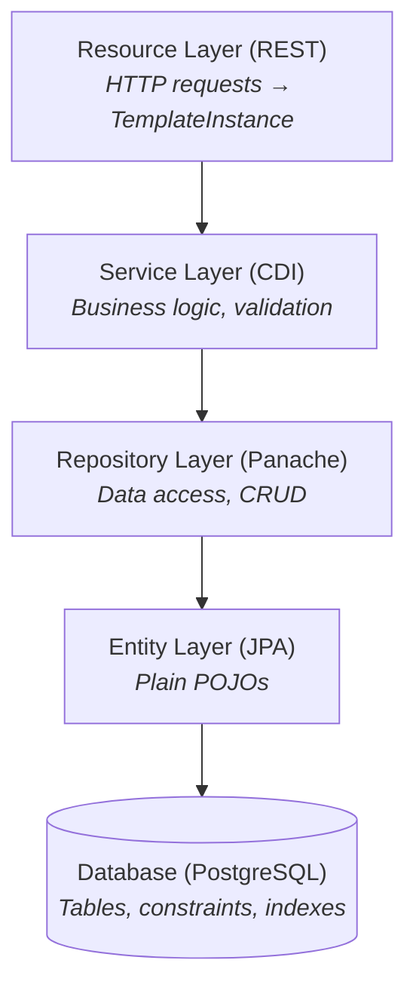

# HX Qute Architecture Guide

A comprehensive technical reference for developing features in this Quarkus + HTMX + Qute application.

---

## Table of Contents

1. [Overview](#1-overview)
2. [Technology Stack](#2-technology-stack)
3. [Project Structure](#3-project-structure)
4. [Database Layer](#4-database-layer)
5. [Entity Layer](#5-entity-layer)
6. [Repository Layer](#6-repository-layer)
7. [Service Layer](#7-service-layer)
8. [Resource Layer](#8-resource-layer)
9. [Template System](#9-template-system)
10. [HTMX Integration](#10-htmx-integration)
11. [Security Architecture](#11-security-architecture)
12. [Configuration Reference](#12-configuration-reference)
13. [Testing Patterns](#13-testing-patterns)
14. [Development Workflow](#14-development-workflow)

---

## 1. Overview

HX Qute is a reference implementation demonstrating modern server-side web development using the hypermedia-driven application (HDA) pattern. It combines Quarkus's reactive capabilities with HTMX's HTML-over-the-wire approach, eliminating the need for complex JavaScript frameworks while delivering responsive, interactive user experiences.

### Design Principles

| Principle | Implementation |
|-----------|----------------|
| Server-Side Rendering | All HTML generated on the server via Qute templates |
| Hypermedia-Driven | HTMX handles partial page updates without full reloads |
| Type Safety | `@CheckedTemplate` ensures compile-time template validation |
| Fragment-Based UI | Qute fragments enable reusable, modal-based CRUD patterns |
| Security by Default | Form authentication with BCrypt password hashing |
| Separation of Concerns | Repository pattern separates data access from business logic |

### Architectural Layers



## 2. Technology Stack

### 2.1 Core Framework

| Component | Technology | Version |
|-----------|------------|---------|
| Framework | Quarkus | 3.30.3 |
| Language | Java | 21 |
| Build Tool | Maven | 3.x |

### 2.2 Backend Dependencies

| Purpose | Extension | Description |
|---------|-----------|-------------|
| REST API | `quarkus-rest` | RESTEasy Reactive endpoints |
| Templating | `quarkus-rest-qute` | Type-safe Qute template integration |
| ORM | `quarkus-hibernate-orm-panache` | Repository pattern for entities |
| Database | `quarkus-jdbc-postgresql` | PostgreSQL JDBC driver |
| Migrations | `quarkus-flyway` | Versioned schema migrations |
| Security | `quarkus-security-jpa` | JPA-based identity provider with BCrypt |
| Validation | `quarkus-hibernate-validator` | Bean validation (JSR-380) |
| CDI | `quarkus-arc` | Dependency injection |
| Testing | `quarkus-junit5` | JUnit 5 integration |

### 2.3 Frontend Stack (CDN-Based)

| Purpose | Technology | Version | CDN |
|---------|------------|---------|-----|
| Dynamic UI | HTMX | 2.0.8 | jsdelivr.net |
| CSS Framework | UIkit | 3.25.4 | jsdelivr.net |
| Custom Styles | CSS | - | Local `/style.css` |

### 2.4 Database

| Component | Technology |
|-----------|------------|
| RDBMS | PostgreSQL 17 |
| Migrations | Flyway |
| ORM | Hibernate with Panache |

---

## 3. Project Structure

```
src/main/java/com/example/app/
├── entity/                    # JPA Entities (POJOs)
│   ├── Category.java          # Lookup/reference entity
│   ├── Item.java              # Main entity with relationships
│   └── UserLogin.java         # Security entity
├── repository/                # PanacheRepository implementations
│   ├── CategoryRepository.java
│   ├── ItemRepository.java
│   └── UserLoginRepository.java
├── service/                   # Business logic and validation
│   ├── CategoryService.java
│   ├── ItemService.java
│   └── exception/
│       ├── ValidationException.java
│       ├── UniqueConstraintException.java
│       └── ReferentialIntegrityException.java
├── router/                    # JAX-RS Resources (Controllers)
│   ├── CategoryResource.java
│   ├── ItemResource.java
│   └── AuthResource.java
└── filter/                    # HTTP Filters
    └── SecurityFilter.java

src/main/resources/
├── templates/
│   ├── base.html              # Base layout
│   ├── CategoryResource/
│   │   └── category.html      # Full page + fragments
│   └── ItemResource/
│       └── item.html
├── db/migration/              # Flyway migrations
│   ├── V001__Create_user_login_table.sql
│   ├── V002__Create_category_table.sql
│   └── V003__Create_item_table.sql
└── application.properties
```

---

## 4. Database Layer

### 4.1 Migration Strategy

Flyway manages schema evolution with versioned SQL scripts:

**Naming Convention**: `V{version}__{description}.sql`

**Example**: `V002__Create_category_table.sql`

**Best Practices**:
- Modify existing migrations because this is a prototype application
- Use `BIGSERIAL` for primary keys with `GenerationType.IDENTITY` in JPA. Do NOT use sequences with Panache entities.

### 4.2 PostgreSQL-Specific Patterns

```sql
-- Lookup/reference table pattern
CREATE TABLE category (
    id BIGSERIAL PRIMARY KEY,
    code VARCHAR(10) NOT NULL,
    name VARCHAR(255) NOT NULL,
    created_at TIMESTAMP WITH TIME ZONE DEFAULT CURRENT_TIMESTAMP,
    updated_at TIMESTAMP WITH TIME ZONE DEFAULT CURRENT_TIMESTAMP,
    created_by VARCHAR(255),
    updated_by VARCHAR(255),

    CONSTRAINT uk_category_code UNIQUE (code),
    CONSTRAINT uk_category_name UNIQUE (name)
);

-- Main entity with foreign key
CREATE TABLE item (
    id BIGSERIAL PRIMARY KEY,
    name VARCHAR(100) NOT NULL,
    description TEXT,
    category_id BIGINT NOT NULL,
    created_at TIMESTAMP WITH TIME ZONE DEFAULT CURRENT_TIMESTAMP,
    updated_at TIMESTAMP WITH TIME ZONE DEFAULT CURRENT_TIMESTAMP,

    CONSTRAINT fk_item_category FOREIGN KEY (category_id) REFERENCES category(id)
);
```

---

## 5. Entity Layer

### 5.1 Entity Pattern (Panache Public Fields)

Entities use **public fields** following the Quarkus Panache recommendation. Panache automatically generates getters and setters at bytecode level during build time, providing proper encapsulation at runtime without boilerplate code.

**Why public fields are safe in Quarkus:**
- Quarkus builds in a "closed world" where all code is known at compile time
- Hibernate needs getter/setter interception for lazy loading and dirty tracking
- Panache generates these accessors automatically—when code reads `entity.field`, it actually calls `getField()`
- You only write explicit accessors when you need custom logic (e.g., transformations)

Entities contain NO business logic or data access methods. This follows the Repository pattern where entities are simple data containers.

```java
package com.example.app.entity;

import jakarta.persistence.*;
import java.time.Instant;

@Entity
@Table(name = "category", uniqueConstraints = {
    @UniqueConstraint(name = "uk_category_code", columnNames = "code"),
    @UniqueConstraint(name = "uk_category_name", columnNames = "name")
})
public class Category {

    @Id
    @GeneratedValue(strategy = GenerationType.IDENTITY)
    public Long id;

    @Column(name = "code", nullable = false, length = 10)
    public String code;

    @Column(name = "name", nullable = false, length = 255)
    public String name;

    @Column(name = "created_at", nullable = false, updatable = false)
    public Instant createdAt;

    @Column(name = "updated_at", nullable = false)
    public Instant updatedAt;

    @Column(name = "created_by")
    public String createdBy;

    @Column(name = "updated_by")
    public String updatedBy;

    // Panache generates getters/setters at bytecode level
    // Only write explicit accessors for custom logic, e.g.:
    // public String getCode() { return code.toUpperCase(); }

    // Lifecycle callbacks for audit timestamps
    @PrePersist
    void onCreate() {
        createdAt = Instant.now();
        updatedAt = Instant.now();
    }

    @PreUpdate
    void onUpdate() {
        updatedAt = Instant.now();
    }
}
```

### 5.2 Entity with Foreign Key Relationships

```java
@Entity
@Table(name = "item", uniqueConstraints = {
    @UniqueConstraint(name = "uk_item_name", columnNames = "name")
})
public class Item {

    @Id
    @GeneratedValue(strategy = GenerationType.IDENTITY)
    public Long id;

    @Column(name = "name", nullable = false, length = 100)
    public String name;

    @Column(name = "description")
    public String description;

    // Many-to-One: Item belongs to one Category
    @ManyToOne(fetch = FetchType.LAZY)
    @JoinColumn(name = "category_id", nullable = false,
        foreignKey = @ForeignKey(name = "fk_item_category"))
    public Category category;

    // Audit fields and lifecycle callbacks...
}
```

### 5.3 UserLogin Entity (Security)

```java
@Entity
@Table(name = "user_login")
@UserDefinition
public class UserLogin {

    @Id
    @GeneratedValue(strategy = GenerationType.IDENTITY)
    public Long id;

    @Username
    @Column(nullable = false, unique = true)
    public String email;

    @Password(value = PasswordType.MCF)
    @Column(nullable = false)
    public String password;

    @Roles
    @Column(nullable = false)
    public String role;

    // Panache generates accessors at bytecode level
}
```

---

## 6. Repository Layer

### 6.1 PanacheRepository Pattern

Repositories implement `PanacheRepository<Entity, ID>` and contain all data access logic. This separates data access concerns from entities, enabling better testability and clearer code organization.

```java
package com.example.app.repository;

import com.example.app.entity.Category;
import io.quarkus.hibernate.orm.panache.PanacheRepository;
import jakarta.enterprise.context.ApplicationScoped;
import java.util.List;
import java.util.Optional;

@ApplicationScoped
public class CategoryRepository implements PanacheRepository<Category> {

    /**
     * Find by unique code.
     */
    public Optional<Category> findByCode(String code) {
        return find("code", code).firstResultOptional();
    }

    /**
     * Find by unique name.
     */
    public Optional<Category> findByName(String name) {
        return find("name", name).firstResultOptional();
    }

    /**
     * Check if a code exists (for unique constraint validation).
     */
    public boolean existsByCode(String code) {
        return count("code", code) > 0;
    }

    /**
     * Check if a code exists for a different entity (for update validation).
     */
    public boolean existsByCodeAndIdNot(String code, Long id) {
        return count("code = ?1 AND id != ?2", code, id) > 0;
    }

    /**
     * Check if a name exists (for unique constraint validation).
     */
    public boolean existsByName(String name) {
        return count("name", name) > 0;
    }

    /**
     * Check if a name exists for a different entity (for update validation).
     */
    public boolean existsByNameAndIdNot(String name, Long id) {
        return count("name = ?1 AND id != ?2", name, id) > 0;
    }

    /**
     * List all ordered by code.
     */
    public List<Category> listAllOrdered() {
        return list("ORDER BY code ASC");
    }
}
```

### 6.2 Repository with Referential Integrity Queries

For entities that are referenced by other entities, the repository should include methods to check if the entity is in use:

```java
@ApplicationScoped
public class CategoryRepository implements PanacheRepository<Category> {

    @Inject
    EntityManager em;

    // ... finder methods from above ...

    /**
     * Check if category is referenced by any Item records.
     * Used to prevent deletion when referential integrity would be violated.
     */
    public boolean isReferencedByItem(Long categoryId) {
        Long count = em.createQuery(
            "SELECT COUNT(i) FROM Item i WHERE i.category.id = :categoryId", Long.class)
            .setParameter("categoryId", categoryId)
            .getSingleResult();
        return count > 0;
    }

    /**
     * Count how many Item records reference this category.
     */
    public long countItemReferences(Long categoryId) {
        return em.createQuery(
            "SELECT COUNT(i) FROM Item i WHERE i.category.id = :categoryId", Long.class)
            .setParameter("categoryId", categoryId)
            .getSingleResult();
    }
}
```

### 6.3 Repository with Search and Foreign Key Validation

```java
@ApplicationScoped
public class ItemRepository implements PanacheRepository<Item> {

    /**
     * Find by unique name (case-insensitive).
     */
    public Optional<Item> findByName(String name) {
        return find("LOWER(name) = LOWER(?1)", name).firstResultOptional();
    }

    /**
     * Check if name exists (case-insensitive).
     */
    public boolean existsByName(String name) {
        return count("LOWER(name) = LOWER(?1)", name) > 0;
    }

    /**
     * Check if name exists for a different item (for update validation).
     */
    public boolean existsByNameAndIdNot(String name, Long id) {
        return count("LOWER(name) = LOWER(?1) AND id != ?2", name, id) > 0;
    }

    /**
     * Search items by filter text (name or description).
     */
    public List<Item> search(String filterText, String sortField, String sortDir) {
        String query = buildSearchQuery(filterText, sortField, sortDir);
        if (filterText == null || filterText.isBlank()) {
            return list(query);
        }
        String pattern = "%" + filterText.toLowerCase() + "%";
        return list(query, pattern, pattern);
    }

    private String buildSearchQuery(String filterText, String sortField, String sortDir) {
        StringBuilder query = new StringBuilder();

        if (filterText != null && !filterText.isBlank()) {
            query.append("LOWER(name) LIKE ?1 OR LOWER(description) LIKE ?2 ");
        }

        String field = "name".equals(sortField) ? "name" : "id";
        String direction = "desc".equalsIgnoreCase(sortDir) ? "DESC" : "ASC";
        query.append("ORDER BY ").append(field).append(" ").append(direction);

        return query.toString();
    }

    /**
     * Validate that a foreign key reference exists.
     */
    public boolean categoryExists(Long categoryId) {
        return getEntityManager()
            .createQuery("SELECT COUNT(c) FROM Category c WHERE c.id = :id", Long.class)
            .setParameter("id", categoryId)
            .getSingleResult() > 0;
    }
}
```

### 6.4 Standard Repository Methods (Inherited from PanacheRepository)

`PanacheRepository` provides these methods automatically:

| Method | Description |
|--------|-------------|
| `persist(entity)` | Save new entity |
| `persistAndFlush(entity)` | Save and immediately flush |
| `delete(entity)` | Delete entity |
| `deleteById(id)` | Delete by primary key |
| `findById(id)` | Find by primary key |
| `findByIdOptional(id)` | Find by primary key (Optional) |
| `listAll()` | List all entities |
| `count()` | Count all entities |
| `find(query, params)` | Query with HQL/JPQL |
| `list(query, params)` | Query returning list |
| `stream(query, params)` | Query returning stream |
| `getEntityManager()` | Access underlying EntityManager |

---

## 7. Service Layer

### 7.1 Service Pattern

Services contain business logic and validation. They orchestrate repository calls and enforce constraints before data is persisted.

```java
package com.example.app.service;

import com.example.app.entity.Category;
import com.example.app.repository.CategoryRepository;
import com.example.app.service.exception.UniqueConstraintException;
import com.example.app.service.exception.ReferentialIntegrityException;
import com.example.app.service.exception.EntityNotFoundException;
import jakarta.enterprise.context.ApplicationScoped;
import jakarta.inject.Inject;
import jakarta.transaction.Transactional;
import java.util.List;
import java.util.Optional;

@ApplicationScoped
public class CategoryService {

    @Inject
    CategoryRepository categoryRepository;

    /**
     * List all categories ordered by code.
     */
    public List<Category> listAll() {
        return categoryRepository.listAllOrdered();
    }

    /**
     * Find category by ID.
     */
    public Optional<Category> findById(Long id) {
        return categoryRepository.findByIdOptional(id);
    }

    /**
     * Create a new category with constraint validation.
     *
     * @throws UniqueConstraintException if code or name already exists
     */
    @Transactional
    public Category create(String code, String name, String createdBy) {
        // Validate unique constraints BEFORE attempting to persist
        validateUniqueConstraintsForCreate(code, name);

        Category category = new Category();
        category.code = code.toUpperCase().trim();
        category.name = name.trim();
        category.createdBy = createdBy;
        category.updatedBy = createdBy;

        categoryRepository.persist(category);
        return category;
    }

    /**
     * Update an existing category with constraint validation.
     *
     * @throws EntityNotFoundException if category not found
     * @throws UniqueConstraintException if code or name conflicts with another record
     */
    @Transactional
    public Category update(Long id, String code, String name, String updatedBy) {
        Category category = categoryRepository.findByIdOptional(id)
            .orElseThrow(() -> new EntityNotFoundException("Category", id));

        // Validate unique constraints, excluding current entity
        validateUniqueConstraintsForUpdate(id, code, name);

        category.code = code.toUpperCase().trim();
        category.name = name.trim();
        category.updatedBy = updatedBy;

        // No explicit persist needed - entity is managed
        return category;
    }

    /**
     * Delete a category with referential integrity check.
     *
     * @throws EntityNotFoundException if category not found
     * @throws ReferentialIntegrityException if category is referenced by Item records
     */
    @Transactional
    public void delete(Long id) {
        Category category = categoryRepository.findByIdOptional(id)
            .orElseThrow(() -> new EntityNotFoundException("Category", id));

        // Check referential integrity BEFORE attempting to delete
        validateReferentialIntegrityForDelete(id);

        categoryRepository.delete(category);
    }

    // ========== Constraint Validation Methods ==========

    private void validateUniqueConstraintsForCreate(String code, String name) {
        if (categoryRepository.existsByCode(code.toUpperCase().trim())) {
            throw new UniqueConstraintException("code", code,
                "A category with code '" + code + "' already exists.");
        }

        if (categoryRepository.existsByName(name.trim())) {
            throw new UniqueConstraintException("name", name,
                "A category with name '" + name + "' already exists.");
        }
    }

    private void validateUniqueConstraintsForUpdate(Long id, String code, String name) {
        if (categoryRepository.existsByCodeAndIdNot(code.toUpperCase().trim(), id)) {
            throw new UniqueConstraintException("code", code,
                "A category with code '" + code + "' already exists.");
        }

        if (categoryRepository.existsByNameAndIdNot(name.trim(), id)) {
            throw new UniqueConstraintException("name", name,
                "A category with name '" + name + "' already exists.");
        }
    }

    private void validateReferentialIntegrityForDelete(Long id) {
        if (categoryRepository.isReferencedByItem(id)) {
            long count = categoryRepository.countItemReferences(id);
            throw new ReferentialIntegrityException("Category", id, "Item", count,
                "Cannot delete category: It is referenced by " + count + " item(s).");
        }
    }
}
```

### 7.2 Service with Foreign Key Validation

For services that create/update entities with foreign key relationships:

```java
@ApplicationScoped
public class ItemService {

    @Inject
    ItemRepository itemRepository;

    @Inject
    CategoryRepository categoryRepository;

    /**
     * Create a new item with constraint validation.
     *
     * @throws UniqueConstraintException if name already exists
     * @throws ReferentialIntegrityException if category doesn't exist
     */
    @Transactional
    public Item create(String name, String description, Long categoryId, String createdBy) {
        // 1. Validate unique constraints
        validateUniqueConstraintsForCreate(name);

        // 2. Validate foreign key references exist
        Category category = validateAndFetchCategory(categoryId);

        // 3. Create entity
        Item item = new Item();
        item.name = name.trim();
        item.description = description;
        item.category = category;
        item.createdBy = createdBy;
        item.updatedBy = createdBy;

        itemRepository.persist(item);
        return item;
    }

    /**
     * Update an existing item with constraint validation.
     */
    @Transactional
    public Item update(Long id, String name, String description, Long categoryId, String updatedBy) {
        Item item = itemRepository.findByIdOptional(id)
            .orElseThrow(() -> new EntityNotFoundException("Item", id));

        // 1. Validate unique constraints (excluding current entity)
        validateUniqueConstraintsForUpdate(id, name);

        // 2. Validate foreign key references if changed
        if (!item.category.id.equals(categoryId)) {
            item.category = validateAndFetchCategory(categoryId);
        }

        // 3. Update fields
        item.name = name.trim();
        item.description = description;
        item.updatedBy = updatedBy;

        return item;
    }

    // ========== Validation Helper Methods ==========

    private void validateUniqueConstraintsForCreate(String name) {
        if (itemRepository.existsByName(name)) {
            throw new UniqueConstraintException("name", name,
                "An item with name '" + name + "' already exists.");
        }
    }

    private void validateUniqueConstraintsForUpdate(Long id, String name) {
        if (itemRepository.existsByNameAndIdNot(name, id)) {
            throw new UniqueConstraintException("name", name,
                "An item with name '" + name + "' already exists.");
        }
    }

    private Category validateAndFetchCategory(Long categoryId) {
        return categoryRepository.findByIdOptional(categoryId)
            .orElseThrow(() -> new ReferentialIntegrityException(
                "Item", null, "Category", categoryId,
                "Invalid category selection. The selected category does not exist."));
    }
}
```

### 7.3 Custom Exception Classes

```java
package com.example.app.service.exception;

/**
 * Thrown when a unique constraint would be violated.
 */
public class UniqueConstraintException extends RuntimeException {
    private final String fieldName;
    private final Object fieldValue;

    public UniqueConstraintException(String fieldName, Object fieldValue, String message) {
        super(message);
        this.fieldName = fieldName;
        this.fieldValue = fieldValue;
    }

    public String getFieldName() { return fieldName; }
    public Object getFieldValue() { return fieldValue; }
}

/**
 * Thrown when referential integrity would be violated.
 */
public class ReferentialIntegrityException extends RuntimeException {
    private final String entityType;
    private final Long entityId;
    private final String referencedType;
    private final Object referenceInfo;

    public ReferentialIntegrityException(String entityType, Long entityId, 
            String referencedType, Object referenceInfo, String message) {
        super(message);
        this.entityType = entityType;
        this.entityId = entityId;
        this.referencedType = referencedType;
        this.referenceInfo = referenceInfo;
    }

    // Getters...
}

/**
 * Thrown when an entity is not found.
 */
public class EntityNotFoundException extends RuntimeException {
    private final String entityType;
    private final Long entityId;

    public EntityNotFoundException(String entityType, Long entityId) {
        super(entityType + " with ID " + entityId + " not found.");
        this.entityType = entityType;
        this.entityId = entityId;
    }

    // Getters...
}
```

### 7.4 Constraint Validation Summary

| Operation | Unique Constraints | Referential Integrity |
|-----------|-------------------|----------------------|
| **CREATE** | Check field doesn't exist | Verify FK references exist |
| **READ** | N/A | N/A |
| **UPDATE** | Check field doesn't exist for OTHER records | Verify FK references exist (if changed) |
| **DELETE** | N/A | Check no dependent records exist |

### 7.5 Validation Flow Diagram

```
CREATE Operation:
┌─────────────────┐     ┌────────────────────────┐     ┌───────────────────────┐
│ Resource Layer  │────▶│    Service Layer       │────▶│   Repository Layer    │
│ (HTTP Request)  │     │ 1. Unique constraints  │     │   persist(entity)     │
└─────────────────┘     │ 2. FK reference exists │     └───────────────────────┘
                        └────────────────────────┘
                               │ Error?
                               ▼
                        ┌─────────────────────────┐
                        │ UniqueConstraintException│
                        │ or ReferentialIntegrity │
                        │ Exception               │
                        └─────────────────────────┘

UPDATE Operation:
┌─────────────────┐     ┌───────────────────────────┐     ┌───────────────────────┐
│ Resource Layer  │────▶│      Service Layer        │────▶│   Repository Layer    │
│ (HTTP Request)  │     │ 1. Entity exists?         │     │   (managed entity)    │
└─────────────────┘     │ 2. Unique (excl. self)    │     └───────────────────────┘
                        │ 3. FK references exist    │
                        └───────────────────────────┘

DELETE Operation:
┌─────────────────┐     ┌───────────────────────────┐     ┌───────────────────────┐
│ Resource Layer  │────▶│      Service Layer        │────▶│   Repository Layer    │
│ (HTTP Request)  │     │ 1. Entity exists?         │     │   delete(entity)      │
└─────────────────┘     │ 2. No dependent records?  │     └───────────────────────┘
                        └───────────────────────────┘
```

---

## 8. Resource Layer

### 8.1 Resource Pattern

Resources serve as controllers, handling HTTP requests and delegating to services. They return TemplateInstance for HTML responses.

```java
@Path("/categories")
@RolesAllowed("admin")
public class CategoryResource {

    @Inject
    CategoryService categoryService;

    @Inject
    SecurityIdentity securityIdentity;

    @CheckedTemplate
    public static class Templates {
        public static native TemplateInstance category(
            String title, String currentPage, String userName, List<Category> categories);
        public static native TemplateInstance category$table(List<Category> categories);
        public static native TemplateInstance category$modal_create(Category category, String error);
        public static native TemplateInstance category$modal_edit(Category category, String error);
        public static native TemplateInstance category$modal_success(String message, List<Category> categories);
        public static native TemplateInstance category$modal_delete(Category category, String error);
        public static native TemplateInstance category$modal_delete_success(Long deletedId);
    }

    @GET
    @Produces(MediaType.TEXT_HTML)
    public TemplateInstance list(@HeaderParam("HX-Request") String hxRequest) {
        List<Category> categories = categoryService.listAll();

        if ("true".equals(hxRequest)) {
            return Templates.category$table(categories);
        }

        String userName = getCurrentUsername();
        return Templates.category("Categories", "category", userName, categories);
    }

    @GET
    @Path("/create")
    @Produces(MediaType.TEXT_HTML)
    public TemplateInstance createForm() {
        return Templates.category$modal_create(new Category(), null);
    }

    @POST
    @Consumes(MediaType.APPLICATION_FORM_URLENCODED)
    @Produces(MediaType.TEXT_HTML)
    public TemplateInstance create(
            @FormParam("code") String code,
            @FormParam("name") String name) {

        String error = validateInput(code, name);
        if (error != null) {
            Category category = new Category();
            category.code = code;
            category.name = name;
            return Templates.category$modal_create(category, error);
        }

        try {
            categoryService.create(code, name, getCurrentUsername());
            List<Category> categories = categoryService.listAll();
            return Templates.category$modal_success("Category created successfully.", categories);

        } catch (UniqueConstraintException e) {
            Category category = new Category();
            category.code = code;
            category.name = name;
            return Templates.category$modal_create(category, e.getMessage());
        }
    }

    @GET
    @Path("/{id}/edit")
    @Produces(MediaType.TEXT_HTML)
    public TemplateInstance editForm(@PathParam("id") Long id) {
        return categoryService.findById(id)
            .map(category -> Templates.category$modal_edit(category, null))
            .orElseThrow(() -> new NotFoundException("Category not found"));
    }

    @PUT
    @Path("/{id}")
    @Consumes(MediaType.APPLICATION_FORM_URLENCODED)
    @Produces(MediaType.TEXT_HTML)
    public TemplateInstance update(
            @PathParam("id") Long id,
            @FormParam("code") String code,
            @FormParam("name") String name) {

        try {
            Category updated = categoryService.update(id, code, name, getCurrentUsername());
            return Templates.category$modal_success("Category updated.", categoryService.listAll());

        } catch (UniqueConstraintException e) {
            Category category = categoryService.findById(id).orElseThrow();
            return Templates.category$modal_edit(category, e.getMessage());

        } catch (EntityNotFoundException e) {
            throw new NotFoundException(e.getMessage());
        }
    }

    @GET
    @Path("/{id}/delete")
    @Produces(MediaType.TEXT_HTML)
    public TemplateInstance deleteConfirm(@PathParam("id") Long id) {
        return categoryService.findById(id)
            .map(category -> Templates.category$modal_delete(category, null))
            .orElseThrow(() -> new NotFoundException("Category not found"));
    }

    @DELETE
    @Path("/{id}")
    @Produces(MediaType.TEXT_HTML)
    public TemplateInstance delete(@PathParam("id") Long id) {
        try {
            categoryService.delete(id);
            return Templates.category$modal_delete_success(id);

        } catch (ReferentialIntegrityException e) {
            Category category = categoryService.findById(id).orElseThrow();
            return Templates.category$modal_delete(category, e.getMessage());

        } catch (EntityNotFoundException e) {
            throw new NotFoundException(e.getMessage());
        }
    }

    private String validateInput(String code, String name) {
        if (code == null || code.isBlank()) return "Code is required.";
        if (name == null || name.isBlank()) return "Name is required.";
        if (code.length() > 10) return "Code must be 10 characters or less.";
        return null;
    }

    private String getCurrentUsername() {
        return securityIdentity.isAnonymous() ? null
            : securityIdentity.getPrincipal().getName();
    }
}
```

### 8.2 Standard CRUD Endpoints

| Method | Path | Handler | Description |
|--------|------|---------|-------------|
| GET | `/entities` | `list()` | List all (full page or table fragment) |
| GET | `/entities/create` | `createForm()` | Return create form modal content |
| POST | `/entities` | `create()` | Submit create form |
| GET | `/entities/{id}/edit` | `editForm()` | Return edit form modal content |
| PUT | `/entities/{id}` | `update()` | Submit edit form |
| GET | `/entities/{id}/delete` | `deleteConfirm()` | Return delete confirmation modal |
| DELETE | `/entities/{id}` | `delete()` | Execute deletion |

### 8.3 Exception Handling in Resources

```java
// Map service exceptions to HTTP responses

// Option 1: Explicit try-catch (shown above)

// Option 2: Global ExceptionMapper
@Provider
public class ServiceExceptionMapper implements ExceptionMapper<RuntimeException> {

    @Override
    public Response toResponse(RuntimeException exception) {
        if (exception instanceof EntityNotFoundException) {
            return Response.status(Status.NOT_FOUND)
                .entity(exception.getMessage())
                .build();
        }
        if (exception instanceof UniqueConstraintException) {
            return Response.status(Status.CONFLICT)
                .entity(exception.getMessage())
                .build();
        }
        if (exception instanceof ReferentialIntegrityException) {
            return Response.status(Status.CONFLICT)
                .entity(exception.getMessage())
                .build();
        }
        // Re-throw unexpected exceptions
        throw exception;
    }
}
```

---

## 9. Template System

### 9.1 Qute Fragments for HTMX

Templates use `{#fragment}` sections for partial responses:

```html
{@java.util.List<com.example.app.entity.Category> categories}
{@java.lang.String title}
{@java.lang.String currentPage}
{@java.lang.String userName}

{#include base.html}
{#title}{title}{/title}

{#content}
<div class="uk-container">
    <h1>Category Management</h1>

    <button class="uk-button uk-button-primary"
            hx-get="/categories/create"
            hx-target="#modal-content"
            hx-on::after-request="UIkit.modal('#crud-modal').show()">
        Add Category
    </button>

    <div id="table-container">
        {#include category$table categories=categories /}
    </div>
</div>

<!-- Modal Shell -->
<div id="crud-modal" uk-modal>
    <div class="uk-modal-dialog">
        <div id="modal-content"></div>
    </div>
</div>
{/content}
{/include}

{#fragment id=table}
<table class="uk-table uk-table-striped">
    <thead>
        <tr>
            <th>Code</th>
            <th>Name</th>
            <th>Actions</th>
        </tr>
    </thead>
    <tbody id="categories-table-body">
        {#for category in categories}
        <tr id="category-row-{category.id}">
            <td>{category.code}</td>
            <td>{category.name}</td>
            <td>
                <div class="uk-button-group">
                    <button class="uk-button uk-button-small uk-button-primary"
                            hx-get="/categories/{category.id}/edit"
                            hx-target="#modal-content"
                            hx-on::after-request="UIkit.modal('#crud-modal').show()">
                        Edit
                    </button>
                    <button class="uk-button uk-button-small uk-button-danger"
                            hx-get="/categories/{category.id}/delete"
                            hx-target="#modal-content"
                            hx-on::after-request="UIkit.modal('#crud-modal').show()">
                        Delete
                    </button>
                </div>
            </td>
        </tr>
        {/for}
    </tbody>
</table>
{/fragment}

{#fragment id=modal_create}
{@com.example.app.entity.Category category}
{@java.lang.String error}
<div class="uk-modal-header">
    <h2 class="uk-modal-title">Create Category</h2>
</div>
<div class="uk-modal-body">
    {#if error}
    <div class="uk-alert uk-alert-danger">{error}</div>
    {/if}
    <form hx-post="/categories" hx-target="#modal-content">
        <div class="uk-margin">
            <label class="uk-form-label">Code</label>
            <input class="uk-input" type="text" name="code"
                   value="{category.code ?: ''}" maxlength="10" required>
        </div>
        <div class="uk-margin">
            <label class="uk-form-label">Name</label>
            <input class="uk-input" type="text" name="name"
                   value="{category.name ?: ''}" maxlength="255" required>
        </div>
        <div class="uk-margin">
            <button class="uk-button uk-button-primary" type="submit">Save</button>
            <button class="uk-button uk-button-default uk-modal-close" type="button">Cancel</button>
        </div>
    </form>
</div>
{/fragment}

{#fragment id=modal_success}
{@java.lang.String message}
{@java.util.List<com.example.app.entity.Category> categories}
<div class="uk-modal-body" hx-on::load="UIkit.modal('#crud-modal').hide()">
    <div class="uk-alert uk-alert-success">{message}</div>
</div>
<!-- OOB update for table -->
<div id="table-container" hx-swap-oob="innerHTML">
    {#include category$table categories=categories /}
</div>
{/fragment}

{#fragment id=modal_delete}
{@com.example.app.entity.Category category}
{@java.lang.String error}
<div class="uk-modal-header">
    <h2 class="uk-modal-title">Delete Category</h2>
</div>
<div class="uk-modal-body">
    {#if error}
    <div class="uk-alert uk-alert-danger">{error}</div>
    {/if}
    <p>Are you sure you want to delete "{category.name}"?</p>
    <div class="uk-margin">
        <button class="uk-button uk-button-danger"
                hx-delete="/categories/{category.id}"
                hx-target="#modal-content">
            Delete
        </button>
        <button class="uk-button uk-button-default uk-modal-close" type="button">Cancel</button>
    </div>
</div>
{/fragment}

{#fragment id=modal_delete_success}
{@java.lang.Long deletedId}
<div class="uk-modal-body" hx-on::load="UIkit.modal('#crud-modal').hide()">
    <div class="uk-alert uk-alert-success">Category deleted successfully.</div>
</div>
<!-- OOB remove the deleted row -->
<tr id="category-row-{deletedId}" hx-swap-oob="delete"></tr>
{/fragment}
```

---

## 10. HTMX Integration

### 10.1 Core HTMX Attributes

| Attribute | Purpose | Example |
|-----------|---------|---------|
| `hx-get` | GET request | `hx-get="/entities"` |
| `hx-post` | POST request | `hx-post="/entities"` |
| `hx-put` | PUT request | `hx-put="/entities/1"` |
| `hx-delete` | DELETE request | `hx-delete="/entities/1"` |
| `hx-target` | Response destination | `hx-target="#modal-content"` |
| `hx-swap` | Swap strategy | `hx-swap="outerHTML"` |
| `hx-swap-oob` | Out-of-band swap | `hx-swap-oob="innerHTML"` |
| `hx-trigger` | Event trigger | `hx-trigger="click"` |
| `hx-on::event` | Inline handler | `hx-on::load="closeModal()"` |

### 10.2 Modal-Based CRUD Pattern

```
User clicks "Add" ──▶ GET /entities/create ──▶ Modal opens with form
                                                      │
User submits form ──▶ POST /entities ────────────────┘
                           │
              ┌────────────┴────────────┐
              │                         │
        Validation Error          Success
              │                         │
              ▼                         ▼
    Re-render form with         Close modal +
    error message in modal      OOB table refresh
```

---

## 11. Creating New Entities - Complete Checklist

When creating a new data entity, follow this checklist:

### 11.1 Database Layer

- [ ] Create Flyway migration: `VXXX__Create_entity_table.sql`
- [ ] Define primary key with `BIGSERIAL`
- [ ] Add unique constraints with named constraints
- [ ] Add foreign key constraints with named constraints
- [ ] Add audit columns (created_at, updated_at, created_by, updated_by)

### 11.2 Entity Layer

- [ ] Create entity class in `entity/` package
- [ ] Add JPA annotations (@Entity, @Table, @Column)
- [ ] Use **public fields** (Panache generates accessors at bytecode level)
- [ ] Define @Id with GenerationType.IDENTITY
- [ ] Add @UniqueConstraint annotations to @Table
- [ ] Define relationships with @ManyToOne, @OneToMany
- [ ] Add @PrePersist and @PreUpdate for audit timestamps
- [ ] Only add explicit getters/setters for custom logic (e.g., transformations)

### 11.3 Repository Layer

- [ ] Create repository class implementing `PanacheRepository<Entity, Long>`
- [ ] Add @ApplicationScoped annotation
- [ ] Implement `findByXxx` methods for unique fields
- [ ] Implement `existsByXxx` methods for unique constraint validation
- [ ] Implement `existsByXxxAndIdNot` methods for update validation
- [ ] Implement `isReferencedByXxx` methods if entity can be referenced
- [ ] Implement `listAllOrdered` for default listing

### 11.4 Service Layer

- [ ] Create service class with @ApplicationScoped
- [ ] Inject repository and related repositories
- [ ] Implement `listAll()` method
- [ ] Implement `findById()` method
- [ ] Implement `create()` with unique constraint validation
- [ ] Implement `update()` with unique constraint validation (excluding self)
- [ ] Implement `delete()` with referential integrity validation
- [ ] Add @Transactional to write methods

### 11.5 Resource Layer

- [ ] Create resource class with @Path
- [ ] Add security annotations (@RolesAllowed)
- [ ] Define @CheckedTemplate inner class with all fragment methods
- [ ] Implement list() endpoint (full page + HTMX fragment)
- [ ] Implement createForm() endpoint
- [ ] Implement create() endpoint with exception handling
- [ ] Implement editForm() endpoint
- [ ] Implement update() endpoint with exception handling
- [ ] Implement deleteConfirm() endpoint
- [ ] Implement delete() endpoint with exception handling

### 11.6 Template Layer

- [ ] Create template file: `templates/EntityResource/entity.html`
- [ ] Define type declarations for all variables
- [ ] Create table fragment (`{#fragment id=table}`)
- [ ] Create modal_create fragment
- [ ] Create modal_edit fragment
- [ ] Create modal_success fragment with OOB updates
- [ ] Create modal_delete fragment
- [ ] Create modal_delete_success fragment with OOB row removal

---

## 12. Testing Patterns

### 12.1 Repository Tests

```java
@QuarkusTest
@TestTransaction
class CategoryRepositoryTest {

    @Inject
    CategoryRepository categoryRepository;

    @Test
    void shouldFindByCode() {
        Category category = createTestCategory("ELEC", "Electronics");
        categoryRepository.persist(category);

        Optional<Category> found = categoryRepository.findByCode("ELEC");

        assertThat(found).isPresent();
        assertThat(found.get().name).isEqualTo("Electronics");
    }

    @Test
    void shouldCheckExistsByCodeAndIdNot() {
        Category cat1 = createTestCategory("ELEC", "Electronics");
        Category cat2 = createTestCategory("BOOK", "Books");
        categoryRepository.persist(cat1);
        categoryRepository.persist(cat2);

        // Should return true when code exists for different ID
        assertThat(categoryRepository.existsByCodeAndIdNot("ELEC", cat2.id)).isTrue();

        // Should return false when checking same ID
        assertThat(categoryRepository.existsByCodeAndIdNot("ELEC", cat1.id)).isFalse();
    }
}
```

### 12.2 Service Tests

```java
@QuarkusTest
class CategoryServiceTest {

    @Inject
    CategoryService categoryService;

    @Test
    @TestTransaction
    void shouldThrowUniqueConstraintExceptionOnDuplicateCode() {
        categoryService.create("ELEC", "Electronics", "test");

        assertThatThrownBy(() -> categoryService.create("ELEC", "Another", "test"))
            .isInstanceOf(UniqueConstraintException.class)
            .hasMessageContaining("code")
            .hasMessageContaining("ELEC");
    }

    @Test
    @TestTransaction
    void shouldThrowReferentialIntegrityExceptionWhenInUse() {
        // Setup: Create category and item using it
        Category category = categoryService.create("ELEC", "Electronics", "test");
        // ... create item with this category ...

        assertThatThrownBy(() -> categoryService.delete(category.id))
            .isInstanceOf(ReferentialIntegrityException.class)
            .hasMessageContaining("referenced");
    }
}
```

---

## 13. Configuration Reference

### 13.1 Database Configuration

```properties
# PostgreSQL connection
quarkus.datasource.db-kind=postgresql
quarkus.datasource.username=${DB_USER:app}
quarkus.datasource.password=${DB_PASS:app}
quarkus.datasource.jdbc.url=jdbc:postgresql://${DB_HOST:localhost}:${DB_PORT:5432}/${DB_NAME:appdb}

# Hibernate settings
quarkus.hibernate-orm.database.generation=none
quarkus.hibernate-orm.log.sql=false

# Flyway migrations
quarkus.flyway.migrate-at-start=true
quarkus.flyway.locations=db/migration
```

### 13.2 Security Configuration

```properties
# Form authentication
quarkus.http.auth.form.enabled=true
quarkus.http.auth.form.login-page=/login
quarkus.http.auth.form.landing-page=/
quarkus.http.auth.form.error-page=/login?error=true

# Route permissions (example)
quarkus.http.auth.permission.admin.paths=/categories,/categories/*
quarkus.http.auth.permission.admin.policy=admin
quarkus.http.auth.permission.authenticated.paths=/items,/items/*
quarkus.http.auth.permission.authenticated.policy=authenticated
```

---

*Document Version: 2.0*
*Pattern: PanacheRepository with Service Layer*
*Last Updated: 2026-01-01*
