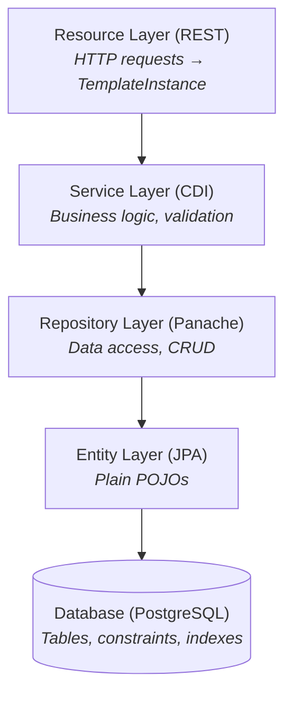

**# HX Qute Architecture Guide

Technical reference for developing features in this Quarkus + HTMX + Qute application.

---

## Table of Contents

1. [Overview](#1-overview)
2. [Technology Stack](#2-technology-stack)
   - [2.5 Static Assets & CSS Organization](#25-static-assets--css-organization)
   - [2.5 JavaScript in HTMX Applications](#javascript-in-htmx-applications)
3. [Database Layer](#3-database-layer)
4. [Entity Layer](#4-entity-layer)
5. [Repository Layer](#5-repository-layer)
   - [5.5 Eager Loading with Entity Graphs](#55-eager-loading-with-entity-graphs)
6. [Service Layer](#6-service-layer)
7. [Resource Layer](#7-resource-layer)
8. [Template System](#8-template-system)
   - [8.1 Fragment Rendering Behavior](#81-fragment-rendering-behavior)
   - [8.2 Fragment Types and Location](#82-fragment-types-and-location)
   - [8.3 Fragment Naming Conventions](#83-fragment-naming-conventions)
   - [8.4 Qute Fragments for HTMX](#84-qute-fragments-for-htmx)
9. [HTMX Integration](#9-htmx-integration)
10. [Creating New Entities - Complete Checklist](#10-creating-new-entities---complete-checklist)
11. [Testing Patterns](#11-testing-patterns)
12. [Configuration Reference](#12-configuration-reference)
    - [12.3 Authentication Endpoints](#123-authentication-endpoints)
    - [12.4 Password Validation](#124-password-validation)
    - [12.5 Security Requirements](#125-security-requirements)
13. [Anti-Patterns](#13-anti-patterns)

---

## 1. Overview

HX Qute is a reference implementation demonstrating modern server-side web development using the hypermedia-driven application (HDA) pattern. It combines Quarkus's reactive capabilities with HTMX's HTML-over-the-wire approach, eliminating the need for complex JavaScript frameworks while delivering responsive, interactive user experiences.

### Design Principles

| Principle | Implementation |
|-----------|----------------|
| Server-Side Rendering | All HTML generated on the server via Qute templates |
| Hypermedia-Driven | HTMX handles partial page updates without full reloads |
| Type Safety | `@CheckedTemplate` ensures compile-time template validation |
| Fragment-Based UI | Qute fragments enable reusable, modal-based CRUD patterns |
| Security by Default | Form authentication with BCrypt password hashing |
| Separation of Concerns | Repository pattern separates data access from business logic |

### Architectural Layers



### Maintaining this Architecture document

This document guides the application's architecture, including its design principles, layers, and technology stack. It serves as a reference for developers to understand and maintain the application's structure and components.

It must only contain information relevant to the application's architecture and design.

Code snippets should be generic examples that can be easily adapted to the application's needs.

If the document must be updated, the update must be in situ and stated as a clear guideline. Do not include details of why the change was made. Just make the change. This is an architecture document that describes the technical details and the structure of the applications as a matter of fact.

Do not give choices. 

It must not contain:

1. sensitive or confidential information
2. code snippets that are specific to the application's detailed implementation
3. details or instructions that are specific to the IDE 

## 2. Technology Stack

### 2.1 Core Framework

| Component | Technology | Version |
|-----------|------------|---------|
| Framework | Quarkus | 3.30.3 |
| Language | Java | 21 |
| Build Tool | Maven | 3.x |

### 2.2 Backend Dependencies

| Purpose | Extension | Description |
|---------|-----------|-------------|
| REST API | `quarkus-rest` | RESTEasy Reactive endpoints |
| Templating | `quarkus-rest-qute` | Type-safe Qute template integration |
| ORM | `quarkus-hibernate-orm-panache` | Repository pattern for entities |
| Database | `quarkus-jdbc-postgresql` | PostgreSQL JDBC driver |
| Migrations | `quarkus-flyway` | Versioned schema migrations |
| Security | `quarkus-security-jpa` | JPA-based identity provider with BCrypt |
| Validation | `quarkus-hibernate-validator` | Bean validation (JSR-380) |
| CDI | `quarkus-arc` | Dependency injection |
| Testing | `quarkus-junit5` | JUnit 5 integration |

### 2.3 Frontend Stack (CDN-Based)

| Purpose | Technology | Version | CDN |
|---------|------------|---------|-----|
| Dynamic UI | HTMX | 2.0.8 | jsdelivr.net |
| CSS Framework | UIkit | 3.25.4 | jsdelivr.net |
| Custom Styles | CSS | - | Local `/style.css` |

### 2.4 Database

| Component | Technology |
|-----------|------------|
| RDBMS | PostgreSQL 17 |
| Migrations | Flyway |
| ORM | Hibernate with Panache |

### 2.5 Static Assets & CSS Organization

Quarkus serves static resources from `src/main/resources/META-INF/resources/`. This is the standard location defined by the Servlet spec for resources in JAR files.

#### Directory Structure

```
src/main/resources/META-INF/resources/
├── style.css           # Application-specific styles
├── css/                # Additional stylesheets (if needed)
│   └── print.css       # Print-specific styles
├── js/                 # Application JavaScript (if needed)
└── images/             # Static images
```

#### CSS Organization Guidelines

| Guideline | Rationale |
|-----------|-----------|
| Single `style.css` for simple apps | Reduces HTTP requests; sufficient for HTMX apps |
| Use CSS custom properties (`:root`) | Centralized theming; easy maintenance |
| Load CSS before JavaScript | CSS is render-blocking; ensures correct initial paint |
| Scope styles to components | Prevents specificity conflicts with UIkit |
| Comment sections clearly | Aids navigation in single-file CSS |

#### CSS File Structure Pattern

```css
/* ============================================
   1. CSS Custom Properties (Variables)
   ============================================ */
:root {
    --brand-primary: #2c5530;
    --brand-secondary: #bfc9c6;
}

/* ============================================
   2. Base/Reset Overrides
   ============================================ */
html, body { ... }

/* ============================================
   3. Layout Components
   ============================================ */
.sidebar { ... }
.main-content-area { ... }

/* ============================================
   4. UIkit Overrides
   ============================================ */
.uk-table th { ... }
.uk-nav-default > li.uk-active > a { ... }

/* ============================================
   5. Application Components
   ============================================ */
.tech-card { ... }

/* ============================================
   6. Utility Classes
   ============================================ */
.visually-hidden { ... }
```

#### Best Practices

1. **Prefix custom classes**: Prefix custom classes with `arc-` to avoid conflicts with UIkit classes
2. **Avoid `!important`**: Structure specificity properly instead of forcing overrides
3. **Use semantic class names**: Name classes by purpose (`.sidebar-nav`), not appearance (`.left-blue-box`)
4. **Group related styles**: Keep component styles together with clear section comments
5. **Minimize UIkit overrides**: Only override framework styles when necessary; use UIkit's built-in modifiers first

#### Performance Considerations

| Practice | Benefit |
|----------|---------|
| Minify CSS in production | Reduces file size |
| Remove unused CSS | Smaller payload |
| Use `preload` for critical CSS | Faster first paint |
| Avoid `@import` in CSS | Prevents render-blocking chains |

#### JavaScript in HTMX Applications

HTMX follows a **hypermedia-first philosophy**: the server returns HTML, and HTMX handles DOM updates. This eliminates most client-side JavaScript needs.

##### When JavaScript is Appropriate

| Use Case | Approach |
|----------|----------|
| UI framework integration (UIkit modals, tooltips) | Inline `hx-on::` attributes |
| Simple DOM manipulation | Inline `hx-on::` attributes |
| Complex reusable logic | External file in `js/arc-utils.js` |
| Third-party library initialization | `htmx.onLoad()` callback |

##### Inline Scripts with `hx-on::`

Prefer inline scripts for **Locality of Behavior (LoB)**—keeping behavior next to the element it affects:

```html
<!-- Good: Behavior co-located with element -->
<button hx-post="/items"
        hx-target="#modal-content"
        hx-on::after-request="UIkit.modal('#crud-modal').show()">
    Add Item
</button>

<!-- Good: Closing modal after success -->
<div hx-on::load="UIkit.modal('#crud-modal').hide()">
    Success message...
</div>
```

##### External JavaScript Files

Use external files only when:
- Logic exceeds 2-3 statements
- Function is reused across multiple templates
- Content Security Policy (CSP) prohibits inline scripts

```
src/main/resources/META-INF/resources/
└── js/
    └── arc-utils.js    # Reusable utility functions
```

**External file pattern:**

```javascript
// js/arc-utils.js
window.Arc = {
    // Initialize third-party libraries on HTMX content loads
    initOnLoad: function() {
        htmx.onLoad(function(content) {
            // Initialize components in newly loaded content
        });
    },

    // Reusable utility called from hx-on::
    confirmDelete: function(name) {
        return confirm('Delete ' + name + '?');
    }
};

// Auto-initialize on page load
document.addEventListener('DOMContentLoaded', Arc.initOnLoad);
```

**Calling from templates:**

```html
<button hx-delete="/items/{id}"
        hx-on::before-request="return Arc.confirmDelete('{item.name}')">
    Delete
</button>
```

##### JavaScript Anti-Patterns

| Anti-Pattern | Why It's Wrong | Correct Approach |
|--------------|----------------|------------------|
| Fetching JSON and rendering client-side | Defeats HTMX's purpose | Return HTML from server |
| Heavy client-side state management | Adds complexity; server is source of truth | Use `hx-vals` or hidden inputs |
| jQuery for DOM manipulation | Unnecessary overhead | Use vanilla JS or `hx-on::` |
| Inline scripts > 3 statements | Obscures template structure | Extract to external file |

##### Compatible Libraries

| Library | Use Case | Integration |
|---------|----------|-------------|
| **UIkit JS** | Modals, dropdowns, notifications | Already included via CDN |
| **Alpine.js** | Reactive local state (optional) | Lightweight; pairs well with HTMX |
| **Vanilla JS** | Simple event handling | No dependencies |

---

## 3. Database Layer

### 3.1 Migration Strategy

Flyway manages schema evolution with versioned SQL scripts:

**Naming Convention**: `V{version}__{description}.sql`

**Example**: `V002__Create_category_table.sql`

**Best Practices**:
- Modify existing migrations because this is a prototype application
- Use `BIGSERIAL` for primary keys with `GenerationType.IDENTITY` in JPA. Do NOT use sequences with Panache entities.

### 3.2 PostgreSQL-Specific Patterns

```sql
-- Lookup/reference table pattern
CREATE TABLE category (
    id BIGSERIAL PRIMARY KEY,
    code VARCHAR(10) NOT NULL,
    name VARCHAR(255) NOT NULL,
    created_at TIMESTAMP WITH TIME ZONE DEFAULT CURRENT_TIMESTAMP,
    updated_at TIMESTAMP WITH TIME ZONE DEFAULT CURRENT_TIMESTAMP,
    created_by VARCHAR(255),
    updated_by VARCHAR(255),

    CONSTRAINT uk_category_code UNIQUE (code),
    CONSTRAINT uk_category_name UNIQUE (name)
);

-- Main entity with foreign key
CREATE TABLE item (
    id BIGSERIAL PRIMARY KEY,
    name VARCHAR(100) NOT NULL,
    description TEXT,
    category_id BIGINT NOT NULL,
    created_at TIMESTAMP WITH TIME ZONE DEFAULT CURRENT_TIMESTAMP,
    updated_at TIMESTAMP WITH TIME ZONE DEFAULT CURRENT_TIMESTAMP,

    CONSTRAINT fk_item_category FOREIGN KEY (category_id) REFERENCES category(id)
);
```

---

## 4. Entity Layer

### 4.1 Entity Pattern

Entities use **public fields** following the Quarkus Panache recommendation. Panache automatically generates getters and setters at bytecode level during build time, providing proper encapsulation at runtime without boilerplate code.

**Why public fields are safe in Quarkus:**
- Quarkus builds in a "closed world" where all code is known at compile time
- Hibernate needs getter/setter interception for lazy loading and dirty tracking
- Panache generates these accessors automatically
- You only write explicit accessors when you need custom logic (e.g., transformations)

Entities contain NO business logic or data access methods. This follows the Repository pattern where entities are simple data containers.

```java
package com.example.app.entity;

import jakarta.persistence.*;
import java.time.Instant;

@Entity
@Table(name = "category", uniqueConstraints = {
    @UniqueConstraint(name = "uk_category_code", columnNames = "code"),
    @UniqueConstraint(name = "uk_category_name", columnNames = "name")
})
public class Category {

    @Id
    @GeneratedValue(strategy = GenerationType.IDENTITY)
    public Long id;

    @Column(name = "code", nullable = false, length = 10)
    public String code;

    @Column(name = "name", nullable = false, length = 255)
    public String name;

    @Column(name = "created_at", nullable = false, updatable = false)
    public Instant createdAt;

    @Column(name = "updated_at", nullable = false)
    public Instant updatedAt;

    @Column(name = "created_by")
    public String createdBy;

    @Column(name = "updated_by")
    public String updatedBy;

    // Panache generates getters/setters at bytecode level
    // Only write explicit accessors for custom logic, e.g.:
    // public String getCode() { return code.toUpperCase(); }

    // Lifecycle callbacks for audit timestamps
    @PrePersist
    void onCreate() {
        createdAt = Instant.now();
        updatedAt = Instant.now();
    }

    @PreUpdate
    void onUpdate() {
        updatedAt = Instant.now();
    }
}
```

### 4.2 Entity with Foreign Key Relationships

```java
@Entity
@Table(name = "item", uniqueConstraints = {
    @UniqueConstraint(name = "uk_item_name", columnNames = "name")
})
public class Item {

    @Id
    @GeneratedValue(strategy = GenerationType.IDENTITY)
    public Long id;

    @Column(name = "name", nullable = false, length = 100)
    public String name;

    @Column(name = "description")
    public String description;

    // Many-to-One: Item belongs to one Category
    @ManyToOne(fetch = FetchType.LAZY)
    @JoinColumn(name = "category_id", nullable = false,
        foreignKey = @ForeignKey(name = "fk_item_category"))
    public Category category;

    // Audit fields and lifecycle callbacks...
}
```

### 4.3 UserLogin Entity (Security)

```java
@Entity
@Table(name = "user_login")
@UserDefinition
public class UserLogin {

    @Id
    @GeneratedValue(strategy = GenerationType.IDENTITY)
    public Long id;

    @Username
    @Column(nullable = false, unique = true)
    public String email;

    @Password(value = PasswordType.MCF)
    @Column(nullable = false)
    public String password;

    @Roles
    @Column(nullable = false)
    public String role;

    // Panache generates accessors at bytecode level
}
```

---

## 5. Repository Layer

### 5.1 PanacheRepository Pattern

Repositories implement `PanacheRepository<Entity, ID>` and contain all data access logic. This separates data access concerns from entities, enabling better testability and clearer code organization.

```java
package com.example.app.repository;

import com.example.app.entity.Category;
import io.quarkus.hibernate.orm.panache.PanacheRepository;
import jakarta.enterprise.context.ApplicationScoped;
import java.util.List;
import java.util.Optional;

@ApplicationScoped
public class CategoryRepository implements PanacheRepository<Category> {

    /**
     * Find by unique code.
     */
    public Optional<Category> findByCode(String code) {
        return find("code", code).firstResultOptional();
    }

    /**
     * Find by unique name.
     */
    public Optional<Category> findByName(String name) {
        return find("name", name).firstResultOptional();
    }

    /**
     * Check if a code exists (for unique constraint validation).
     */
    public boolean existsByCode(String code) {
        return count("code", code) > 0;
    }

    /**
     * Check if a code exists for a different entity (for update validation).
     */
    public boolean existsByCodeAndIdNot(String code, Long id) {
        return count("code = ?1 AND id != ?2", code, id) > 0;
    }

    /**
     * Check if a name exists (for unique constraint validation).
     */
    public boolean existsByName(String name) {
        return count("name", name) > 0;
    }

    /**
     * Check if a name exists for a different entity (for update validation).
     */
    public boolean existsByNameAndIdNot(String name, Long id) {
        return count("name = ?1 AND id != ?2", name, id) > 0;
    }

    /**
     * List all ordered by code.
     */
    public List<Category> listAllOrdered() {
        return list("ORDER BY code ASC");
    }
}
```

### 5.2 Repository with Referential Integrity Queries

For entities that are referenced by other entities, the repository should include methods to check if the entity is in use. Inject the referencing repository and use Panache's `count()` method:

```java
@ApplicationScoped
public class CategoryRepository implements PanacheRepository<Category> {

    @Inject
    ItemRepository itemRepository;

    // ... finder methods from above ...

    /**
     * Check if category is referenced by any Item records.
     * Used to prevent deletion when referential integrity would be violated.
     */
    public boolean isReferencedByItem(Long categoryId) {
        return itemRepository.count("category.id", categoryId) > 0;
    }

    /**
     * Count how many Item records reference this category.
     */
    public long countItemReferences(Long categoryId) {
        return itemRepository.count("category.id", categoryId);
    }
}
```

### 5.3 Repository with Search and Foreign Key Validation

```java
@ApplicationScoped
public class ItemRepository implements PanacheRepository<Item> {

    @Inject
    CategoryRepository categoryRepository;

    /**
     * Find by unique name (case-insensitive).
     */
    public Optional<Item> findByName(String name) {
        return find("LOWER(name) = LOWER(?1)", name).firstResultOptional();
    }

    /**
     * Check if name exists (case-insensitive).
     */
    public boolean existsByName(String name) {
        return count("LOWER(name) = LOWER(?1)", name) > 0;
    }

    /**
     * Check if name exists for a different item (for update validation).
     */
    public boolean existsByNameAndIdNot(String name, Long id) {
        return count("LOWER(name) = LOWER(?1) AND id != ?2", name, id) > 0;
    }

    /**
     * Search items by filter text (name or description).
     */
    public List<Item> search(String filterText, String sortField, String sortDir) {
        String query = buildSearchQuery(filterText, sortField, sortDir);
        if (filterText == null || filterText.isBlank()) {
            return list(query);
        }
        String pattern = "%" + filterText.toLowerCase() + "%";
        return list(query, pattern, pattern);
    }

    private String buildSearchQuery(String filterText, String sortField, String sortDir) {
        StringBuilder query = new StringBuilder();

        if (filterText != null && !filterText.isBlank()) {
            query.append("LOWER(name) LIKE ?1 OR LOWER(description) LIKE ?2 ");
        }

        String field = "name".equals(sortField) ? "name" : "id";
        String direction = "desc".equalsIgnoreCase(sortDir) ? "DESC" : "ASC";
        query.append("ORDER BY ").append(field).append(" ").append(direction);

        return query.toString();
    }

    /**
     * Validate that a foreign key reference exists.
     */
    public boolean categoryExists(Long categoryId) {
        return categoryRepository.findByIdOptional(categoryId).isPresent();
    }
}
```

### 5.4 Standard Repository Methods

`PanacheRepository` provides these methods automatically:

| Method | Description |
|--------|-------------|
| `persist(entity)` | Save new entity |
| `persistAndFlush(entity)` | Save and immediately flush |
| `delete(entity)` | Delete entity |
| `deleteById(id)` | Delete by primary key |
| `findById(id)` | Find by primary key |
| `findByIdOptional(id)` | Find by primary key (Optional) |
| `listAll()` | List all entities |
| `count()` | Count all entities |
| `find(query, params)` | Query with HQL/JPQL |
| `list(query, params)` | Query returning list |
| `stream(query, params)` | Query returning stream |
| `getEntityManager()` | Access underlying EntityManager |

### 5.5 Eager Loading with Entity Graphs

When you need to eagerly load associations (avoiding N+1 queries), use **JPA Entity Graphs** instead of raw JPQL with `JOIN FETCH`. Entity Graphs integrate cleanly with Panache's fluent API.

**Why Entity Graphs over JPQL JOIN FETCH:**
- Declarative fetch strategy defined on the entity
- Reusable across multiple repository methods
- No string concatenation for JPQL queries
- Supports nested associations via subgraphs
- Works with Panache's `find()`, `findAll()`, and `list()` methods

#### Define Entity Graph on Entity

```java
@Entity
@NamedEntityGraphs({
    @NamedEntityGraph(
        name = "Order.withItems",
        attributeNodes = {
            @NamedAttributeNode(value = "items", subgraph = "items-product"),
            @NamedAttributeNode("customer")
        },
        subgraphs = @NamedSubgraph(
            name = "items-product",
            attributeNodes = @NamedAttributeNode("product")
        )
    )
})
public class Order {
    @ManyToOne(fetch = FetchType.LAZY)
    public Customer customer;

    @OneToMany(mappedBy = "order", fetch = FetchType.LAZY)
    public List<OrderItem> items;
}
```

#### Use with Panache Fluent API

```java
@ApplicationScoped
public class OrderRepository implements PanacheRepository<Order> {

    private static final String FETCH_GRAPH_HINT = "jakarta.persistence.fetchgraph";

    /**
     * Find orders with items and products eagerly loaded.
     */
    public List<Order> findByCustomerWithItems(Long customerId) {
        EntityGraph<?> graph = getEntityManager().getEntityGraph("Order.withItems");

        return find("customer.id", customerId)
            .withHint(FETCH_GRAPH_HINT, graph)
            .list();
    }

    /**
     * Find all orders with eager loading for reporting.
     */
    public List<Order> findAllForReport() {
        EntityGraph<?> graph = getEntityManager().getEntityGraph("Order.withItems");

        return findAll()
            .withHint(FETCH_GRAPH_HINT, graph)
            .list();
    }
}
```

#### Multiple Entity Graphs

Define multiple graphs for different use cases:

```java
@NamedEntityGraphs({
    @NamedEntityGraph(
        name = "Person.withTitle",
        attributeNodes = @NamedAttributeNode("title")
    ),
    @NamedEntityGraph(
        name = "Person.full",
        attributeNodes = {
            @NamedAttributeNode("title"),
            @NamedAttributeNode("gender"),
            @NamedAttributeNode("relationships")
        }
    )
})
@Entity
public class Person { ... }
```

**Anti-Pattern to Avoid:**

```java
// ❌ WRONG: Raw JPQL with JOIN FETCH
public List<Order> findWithItems(Long customerId) {
    return getEntityManager()
        .createQuery(
            "SELECT o FROM Order o " +
            "JOIN FETCH o.items i " +
            "JOIN FETCH i.product " +
            "WHERE o.customer.id = ?1", Order.class)
        .setParameter(1, customerId)
        .getResultList();
}

// ✅ CORRECT: Entity Graph with Panache
public List<Order> findWithItems(Long customerId) {
    EntityGraph<?> graph = getEntityManager().getEntityGraph("Order.withItems");
    return find("customer.id", customerId)
        .withHint(FETCH_GRAPH_HINT, graph)
        .list();
}
```

---

## 6. Service Layer

### 6.0 When to Use a Service Layer

The service layer is **optional per entity**, not mandatory. Use it to implement business rules and complex validation logic.

#### When a Service Layer is Required

| Scenario | Example |
|----------|---------|
| **Security-sensitive operations** | Password hashing with BCrypt, token generation |
| **Multi-entity transactions** | Creating an order with line items atomically |
| **Complex business rules** | Discount calculations, eligibility checks |
| **Cross-cutting orchestration** | Operations requiring multiple repository calls |
| **Reusable business operations** | Logic called from multiple resources |

#### When a Service Layer is Unnecessary

| Scenario | Better Approach |
|----------|-----------------|
| **Simple CRUD** | Resource → Repository directly |
| **Lookup tables** (Gender, Title, Status) | Resource → Repository directly |
| **Basic field validation** | Bean Validation (`@Valid`) or inline in Resource |
| **Single repository calls** | No service indirection needed |

#### Decision Guide

```
Does the operation involve:
├─ Password hashing or security tokens? → Use Service
├─ Multiple repository calls in one transaction? → Use Service
├─ Complex business rules beyond validation? → Use Service
├─ Just CRUD with field validation? → Skip Service (Resource → Repository)
└─ Lookup table management? → Skip Service (Resource → Repository)
```

### 6.1 Service Example: Security-Sensitive Operations

This example shows a justified service layer for user authentication—password hashing requires BCrypt, which is security-sensitive logic that doesn't belong in a Resource.

```java
package com.example.app.service;

import com.example.app.entity.UserLogin;
import com.example.app.repository.UserLoginRepository;
import com.example.app.service.exception.UniqueConstraintException;
import io.quarkus.elytron.security.common.BcryptUtil;
import jakarta.enterprise.context.ApplicationScoped;
import jakarta.inject.Inject;
import jakarta.transaction.Transactional;

@ApplicationScoped
public class UserLoginService {

    @Inject
    UserLoginRepository userLoginRepository;

    /**
     * Create a new user with hashed password.
     * Password is hashed using BCrypt with cost factor 12.
     *
     * @throws UniqueConstraintException if email already exists
     */
    @Transactional
    public UserLogin create(String email, String plainPassword, String role) {
        String normalizedEmail = email.toLowerCase().trim();

        // Validate unique constraint
        if (userLoginRepository.emailExists(normalizedEmail)) {
            throw new UniqueConstraintException("email", normalizedEmail,
                "A user with email '" + normalizedEmail + "' already exists.");
        }

        UserLogin user = new UserLogin();
        user.email = normalizedEmail;
        user.password = BcryptUtil.bcryptHash(plainPassword, 12);  // Security-sensitive!
        user.role = role;

        userLoginRepository.persist(user);
        return user;
    }

    /**
     * Check if email exists.
     */
    public boolean emailExists(String email) {
        return userLoginRepository.emailExists(email.toLowerCase().trim());
    }
}
```

**Why this warrants a service:**
- BCrypt password hashing is security-sensitive (belongs in service, not resource)
- Password validation rules may be complex (length, complexity requirements)
- User creation is a business operation, not just data storage

### 6.2 Custom Exception Classes

```java
package com.example.app.service.exception;

/**
 * Thrown when a unique constraint would be violated.
 */
public class UniqueConstraintException extends RuntimeException {
    private final String fieldName;
    private final Object fieldValue;

    public UniqueConstraintException(String fieldName, Object fieldValue, String message) {
        super(message);
        this.fieldName = fieldName;
        this.fieldValue = fieldValue;
    }

    public String getFieldName() { return fieldName; }
    public Object getFieldValue() { return fieldValue; }
}

/**
 * Thrown when referential integrity would be violated.
 */
public class ReferentialIntegrityException extends RuntimeException {
    private final String entityType;
    private final Long entityId;
    private final String referencedType;
    private final Object referenceInfo;

    public ReferentialIntegrityException(String entityType, Long entityId, 
            String referencedType, Object referenceInfo, String message) {
        super(message);
        this.entityType = entityType;
        this.entityId = entityId;
        this.referencedType = referencedType;
        this.referenceInfo = referenceInfo;
    }

    // Getters...
}

/**
 * Thrown when an entity is not found.
 */
public class EntityNotFoundException extends RuntimeException {
    private final String entityType;
    private final Long entityId;

    public EntityNotFoundException(String entityType, Long entityId) {
        super(entityType + " with ID " + entityId + " not found.");
        this.entityType = entityType;
        this.entityId = entityId;
    }

    // Getters...
}
```

---

## 7. Resource Layer

### 7.1 Resource Pattern

Resources serve as controllers, handling HTTP requests and returning TemplateInstance for HTML responses.

**Choose your injection based on entity complexity:**
- **Simple CRUD** (lookup tables): inject Repository directly. See [Anti-Pattern 13.4](#134-avoid-anemicpass-through-services).
- **Complex entities** (security, transactions): inject Service. Example below.

The following example shows a Resource using a Service. For simple CRUD without a service, adapt by injecting the Repository and adding `@Transactional` to mutating methods.

```java
@Path("/categories")
@RolesAllowed("admin")
public class CategoryResource {

    @Inject
    CategoryService categoryService;  // Use Repository directly for simple CRUD

    @Inject
    SecurityIdentity securityIdentity;

    @CheckedTemplate
    public static class Templates {
        public static native TemplateInstance category(
            String title, String currentPage, String userName, List<Category> categories);
        public static native TemplateInstance category$table(List<Category> categories);
        public static native TemplateInstance category$modal_create(Category category, String error);
        public static native TemplateInstance category$modal_edit(Category category, String error);
        public static native TemplateInstance category$modal_success(String message, List<Category> categories);
        public static native TemplateInstance category$modal_delete(Category category, String error);
        public static native TemplateInstance category$modal_delete_success(Long deletedId);
    }

    @GET
    @Produces(MediaType.TEXT_HTML)
    public TemplateInstance list(@HeaderParam("HX-Request") String hxRequest) {
        List<Category> categories = categoryService.listAll();

        if ("true".equals(hxRequest)) {
            return Templates.category$table(categories);
        }

        String userName = getCurrentUsername();
        return Templates.category("Categories", "category", userName, categories);
    }

    @GET
    @Path("/create")
    @Produces(MediaType.TEXT_HTML)
    public TemplateInstance createForm() {
        return Templates.category$modal_create(new Category(), null);
    }

    @POST
    @Consumes(MediaType.APPLICATION_FORM_URLENCODED)
    @Produces(MediaType.TEXT_HTML)
    public TemplateInstance create(
            @FormParam("code") String code,
            @FormParam("name") String name) {

        String error = validateInput(code, name);
        if (error != null) {
            Category category = new Category();
            category.code = code;
            category.name = name;
            return Templates.category$modal_create(category, error);
        }

        try {
            categoryService.create(code, name, getCurrentUsername());
            List<Category> categories = categoryService.listAll();
            return Templates.category$modal_success("Category created successfully.", categories);

        } catch (UniqueConstraintException e) {
            Category category = new Category();
            category.code = code;
            category.name = name;
            return Templates.category$modal_create(category, e.getMessage());
        }
    }

    @GET
    @Path("/{id}/edit")
    @Produces(MediaType.TEXT_HTML)
    public TemplateInstance editForm(@PathParam("id") Long id) {
        return categoryService.findById(id)
            .map(category -> Templates.category$modal_edit(category, null))
            .orElseThrow(() -> new NotFoundException("Category not found"));
    }

    @PUT
    @Path("/{id}")
    @Consumes(MediaType.APPLICATION_FORM_URLENCODED)
    @Produces(MediaType.TEXT_HTML)
    public TemplateInstance update(
            @PathParam("id") Long id,
            @FormParam("code") String code,
            @FormParam("name") String name) {

        try {
            Category updated = categoryService.update(id, code, name, getCurrentUsername());
            return Templates.category$modal_success("Category updated.", categoryService.listAll());

        } catch (UniqueConstraintException e) {
            Category category = categoryService.findById(id).orElseThrow();
            return Templates.category$modal_edit(category, e.getMessage());

        } catch (EntityNotFoundException e) {
            throw new NotFoundException(e.getMessage());
        }
    }

    @GET
    @Path("/{id}/delete")
    @Produces(MediaType.TEXT_HTML)
    public TemplateInstance deleteConfirm(@PathParam("id") Long id) {
        return categoryService.findById(id)
            .map(category -> Templates.category$modal_delete(category, null))
            .orElseThrow(() -> new NotFoundException("Category not found"));
    }

    @DELETE
    @Path("/{id}")
    @Produces(MediaType.TEXT_HTML)
    public TemplateInstance delete(@PathParam("id") Long id) {
        try {
            categoryService.delete(id);
            return Templates.category$modal_delete_success(id);

        } catch (ReferentialIntegrityException e) {
            Category category = categoryService.findById(id).orElseThrow();
            return Templates.category$modal_delete(category, e.getMessage());

        } catch (EntityNotFoundException e) {
            throw new NotFoundException(e.getMessage());
        }
    }

    private String validateInput(String code, String name) {
        if (code == null || code.isBlank()) return "Code is required.";
        if (name == null || name.isBlank()) return "Name is required.";
        if (code.length() > 10) return "Code must be 10 characters or less.";
        return null;
    }

    private String getCurrentUsername() {
        return securityIdentity.isAnonymous() ? null
            : securityIdentity.getPrincipal().getName();
    }
}
```

### 7.2 Standard CRUD Endpoints

| Method | Path | Handler | Description |
|--------|------|---------|-------------|
| GET | `/entities` | `list()` | List all (full page or table fragment) |
| GET | `/entities/create` | `createForm()` | Return create form modal content |
| POST | `/entities` | `create()` | Submit create form |
| GET | `/entities/{id}/edit` | `editForm()` | Return edit form modal content |
| PUT | `/entities/{id}` | `update()` | Submit edit form |
| GET | `/entities/{id}/delete` | `deleteConfirm()` | Return delete confirmation modal |
| DELETE | `/entities/{id}` | `delete()` | Execute deletion |

### 7.3 Exception Handling in Resources

```java
// Map service exceptions to HTTP responses

// Option 1: Explicit try-catch (shown above)

// Option 2: Global ExceptionMapper
@Provider
public class ServiceExceptionMapper implements ExceptionMapper<RuntimeException> {

    @Override
    public Response toResponse(RuntimeException exception) {
        if (exception instanceof EntityNotFoundException) {
            return Response.status(Status.NOT_FOUND)
                .entity(exception.getMessage())
                .build();
        }
        if (exception instanceof UniqueConstraintException) {
            return Response.status(Status.CONFLICT)
                .entity(exception.getMessage())
                .build();
        }
        if (exception instanceof ReferentialIntegrityException) {
            return Response.status(Status.CONFLICT)
                .entity(exception.getMessage())
                .build();
        }
        // Re-throw unexpected exceptions
        throw exception;
    }
}
```

---

## 8. Template System

### 8.1 Fragment Rendering Behavior

Qute fragments have two rendering behaviors:

1. **In-place rendering**: By default, fragment content renders at its definition location AND is available for `{#include}`
2. **Include-only rendering**: With `rendered=false`, fragment content only renders when explicitly included

**Critical Rule**: Fragments defined within a page template use `rendered=false` to prevent duplicate content:

```html
{#fragment id='table' rendered=false}
<!-- This content only renders when included via {#include $table /} -->
{/fragment}
```

Without `rendered=false`, the fragment content appears twice: once where included, and once at the fragment definition location (typically at the end of the document).

### 8.2 Fragment Types and Location

| Fragment Type | Location | Rendering | Example |
|---------------|----------|-----------|---------|
| Shared fragments | `templates/fragments/` | Renders only when included (separate file) | `navigation.html` |
| Page fragments | Same template file | Uses `rendered=false` | `{#fragment id='table' rendered=false}` |

**Shared fragments** (navigation, footer, common components) live in `templates/fragments/` as standalone files:

```
templates/
├── fragments/
│   └── navigation.html      # Shared navigation component
├── base.html                 # Base layout, includes fragments/navigation
└── PersonResource/
    └── person.html           # Page template with inline fragments
```

Including a shared fragment from a separate file:
```html
{#include fragments/navigation /}
```

### 8.3 Fragment Naming Conventions

Qute fragments use `{#fragment id=...}` in templates and are accessed via `$` notation in Java:

| Fragment ID | Java Method | Purpose |
|-------------|-------------|---------|
| `{#fragment id=table}` | `Templates.entity$table(...)` | Data table partial |
| `{#fragment id=modal_create}` | `Templates.entity$modal_create(...)` | Create form modal |
| `{#fragment id=modal_edit}` | `Templates.entity$modal_edit(...)` | Edit form modal |
| `{#fragment id=modal_delete}` | `Templates.entity$modal_delete(...)` | Delete confirmation modal |
| `{#fragment id=modal_success}` | `Templates.entity$modal_success(...)` | Success message with OOB update |
| `{#fragment id=modal_delete_success}` | `Templates.entity$modal_delete_success(...)` | Delete success with OOB row removal |

**Pattern:** `{#fragment id=name}` → `Templates.{templatefile}${fragmentid}(...)`

**Example for `person.html`:**

```java
// In PersonResource.java
@CheckedTemplate
public static class Templates {
    public static native TemplateInstance person(...);                    // Full page
    public static native TemplateInstance person$table(...);              // {#fragment id=table}
    public static native TemplateInstance person$modal_create(...);       // {#fragment id=modal_create}
    public static native TemplateInstance person$modal_edit(...);         // {#fragment id=modal_edit}
    public static native TemplateInstance person$modal_delete(...);       // {#fragment id=modal_delete}
    public static native TemplateInstance person$modal_success(...);      // {#fragment id=modal_success}
    public static native TemplateInstance person$modal_delete_success(...); // {#fragment id=modal_delete_success}
}
```

**Template-Side Fragment Includes:**

Within templates, use the `$` prefix to include fragments:

| Syntax | Description | Example |
|--------|-------------|---------|
| `{#include $fragmentId /}` | Include fragment from **same** template | `{#include $table /}` |
| `{#include templateName$fragmentId /}` | Include fragment from **another** template | `{#include item$item_aliases /}` |
| `{#include templateName /}` | Include entire template (not a fragment) | `{#include base /}` |

**Same-Template Fragment Example:**

```html
<!-- In gender.html: include the 'table' fragment defined later in this file -->
<div id="gender-table-container">{#include $table /}</div>

<!-- Fragment definition (at end of file) -->
{#fragment id='table' rendered=false}
<table>...</table>
{/fragment}
```

**Cross-Template Fragment Example:**

```html
<!-- In user.html: include 'item_aliases' fragment from item.html -->
{#include item$item_aliases aliases=user.aliases /}
```

**Passing Parameters to Fragments:**

```html
<!-- Pass the 'genders' variable to the fragment -->
{#include $table genders=genders /}
```

### 8.4 Qute Fragments for HTMX

Templates use `{#fragment}` sections with `rendered=false` for partial responses:

```html
{@java.util.List<com.example.app.entity.Category> categories}
{@java.lang.String title}
{@java.lang.String currentPage}
{@java.lang.String userName}

{#include base.html}
{#title}{title}{/title}

{#content}
<div class="uk-container">
    <h1>Category Management</h1>

    <button class="uk-button uk-button-primary"
            hx-get="/categories/create"
            hx-target="#modal-content"
            hx-on::after-request="UIkit.modal('#crud-modal').show()">
        Add Category
    </button>

    <div id="table-container">
        {#include category$table categories=categories /}
    </div>
</div>

<!-- Modal Shell -->
<div id="crud-modal" uk-modal>
    <div class="uk-modal-dialog">
        <div id="modal-content"></div>
    </div>
</div>
{/content}
{/include}

{#fragment id=table rendered=false}
<table class="uk-table uk-table-striped">
    <thead>
        <tr>
            <th>Code</th>
            <th>Name</th>
            <th>Actions</th>
        </tr>
    </thead>
    <tbody id="categories-table-body">
        {#for category in categories}
        <tr id="category-row-{category.id}">
            <td>{category.code}</td>
            <td>{category.name}</td>
            <td>
                <div class="uk-button-group">
                    <button class="uk-button uk-button-small uk-button-primary"
                            hx-get="/categories/{category.id}/edit"
                            hx-target="#modal-content"
                            hx-on::after-request="UIkit.modal('#crud-modal').show()">
                        Edit
                    </button>
                    <button class="uk-button uk-button-small uk-button-danger"
                            hx-get="/categories/{category.id}/delete"
                            hx-target="#modal-content"
                            hx-on::after-request="UIkit.modal('#crud-modal').show()">
                        Delete
                    </button>
                </div>
            </td>
        </tr>
        {/for}
    </tbody>
</table>
{/fragment}

{#fragment id=modal_create rendered=false}
{@com.example.app.entity.Category category}
{@java.lang.String error}
<div class="uk-modal-header">
    <h2 class="uk-modal-title">Create Category</h2>
</div>
<div class="uk-modal-body">
    {#if error}
    <div class="uk-alert uk-alert-danger">{error}</div>
    {/if}
    <form hx-post="/categories" hx-target="#modal-content">
        <div class="uk-margin">
            <label class="uk-form-label">Code</label>
            <input class="uk-input" type="text" name="code"
                   value="{category.code ?: ''}" maxlength="10" required>
        </div>
        <div class="uk-margin">
            <label class="uk-form-label">Name</label>
            <input class="uk-input" type="text" name="name"
                   value="{category.name ?: ''}" maxlength="255" required>
        </div>
        <div class="uk-margin">
            <button class="uk-button uk-button-primary" type="submit">Save</button>
            <button class="uk-button uk-button-default uk-modal-close" type="button">Cancel</button>
        </div>
    </form>
</div>
{/fragment}

{#fragment id=modal_success rendered=false}
{@java.lang.String message}
{@java.util.List<com.example.app.entity.Category> categories}
<div class="uk-modal-body" hx-on::load="UIkit.modal('#crud-modal').hide()">
    <div class="uk-alert uk-alert-success">{message}</div>
</div>
<!-- OOB update for table -->
<div id="table-container" hx-swap-oob="innerHTML">
    {#include category$table categories=categories /}
</div>
{/fragment}

{#fragment id=modal_delete rendered=false}
{@com.example.app.entity.Category category}
{@java.lang.String error}
<div class="uk-modal-header">
    <h2 class="uk-modal-title">Delete Category</h2>
</div>
<div class="uk-modal-body">
    {#if error}
    <div class="uk-alert uk-alert-danger">{error}</div>
    {/if}
    <p>Are you sure you want to delete "{category.name}"?</p>
    <div class="uk-margin">
        <button class="uk-button uk-button-danger"
                hx-delete="/categories/{category.id}"
                hx-target="#modal-content">
            Delete
        </button>
        <button class="uk-button uk-button-default uk-modal-close" type="button">Cancel</button>
    </div>
</div>
{/fragment}

{#fragment id=modal_delete_success rendered=false}
{@java.lang.Long deletedId}
<div class="uk-modal-body" hx-on::load="UIkit.modal('#crud-modal').hide()">
    <div class="uk-alert uk-alert-success">Category deleted successfully.</div>
</div>
<!-- OOB remove the deleted row -->
<tr id="category-row-{deletedId}" hx-swap-oob="delete"></tr>
{/fragment}
```

---

## 9. HTMX Integration

### 9.1 Core HTMX Attributes

| Attribute | Purpose | Example |
|-----------|---------|---------|
| `hx-get` | GET request | `hx-get="/entities"` |
| `hx-post` | POST request | `hx-post="/entities"` |
| `hx-put` | PUT request | `hx-put="/entities/1"` |
| `hx-delete` | DELETE request | `hx-delete="/entities/1"` |
| `hx-target` | Response destination | `hx-target="#modal-content"` |
| `hx-swap` | Swap strategy | `hx-swap="outerHTML"` |
| `hx-swap-oob` | Out-of-band swap | `hx-swap-oob="innerHTML"` |
| `hx-trigger` | Event trigger | `hx-trigger="click"` |
| `hx-on::event` | Inline handler | `hx-on::load="closeModal()"` |

### 9.2 Modal-Based CRUD Pattern

```
User clicks "Add" ──▶ GET /entities/create ──▶ Modal opens with form
                                                      │
User submits form ──▶ POST /entities ────────────────┘
                           │
              ┌────────────┴────────────┐
              │                         │
        Validation Error          Success
              │                         │
              ▼                         ▼
    Re-render form with         Close modal +
    error message in modal      OOB table refresh
```

---

## 10. Creating New Entities - Complete Checklist

When creating a new data entity, follow this checklist:

### 10.0 File Naming Conventions

| Layer | Naming Pattern | Location |
|-------|----------------|----------|
| Entity | `{EntityName}.java` | `src/main/java/.../entity/` |
| Repository | `{EntityName}Repository.java` | `src/main/java/.../repository/` |
| Service | `{EntityName}Service.java` | `src/main/java/.../service/` |
| Resource | `{EntityName}Resource.java` | `src/main/java/.../router/` |
| Template | `{entityname}.html` | `src/main/resources/templates/{EntityName}Resource/` |
| Migration | `V{NNN}__{description}.sql` | `src/main/resources/db/migration/` |

**Examples for a `Person` entity:**

| Layer | File Name | Full Path |
|-------|-----------|-----------|
| Entity | `Person.java` | `src/main/java/.../entity/Person.java` |
| Repository | `PersonRepository.java` | `src/main/java/.../repository/PersonRepository.java` |
| Service | `PersonService.java` | `src/main/java/.../service/PersonService.java` |
| Resource | `PersonResource.java` | `src/main/java/.../router/PersonResource.java` |
| Template | `person.html` | `src/main/resources/templates/PersonResource/person.html` |
| Migration | `V004__Create_person_table.sql` | `src/main/resources/db/migration/V004__Create_person_table.sql` |

**Notes:**
- Entity names use PascalCase (e.g., `UserLogin`, `OrderItem`)
- Template filenames use lowercase (e.g., `userlogin.html`, `orderitem.html`)
- Template directories match the Resource class name exactly
- Migration version numbers are zero-padded to 3 digits for proper ordering

### 10.1 Database Layer

- [ ] Create Flyway migration: `VXXX__Create_entity_table.sql`
- [ ] Define primary key with `BIGSERIAL`
- [ ] Add unique constraints with named constraints
- [ ] Add foreign key constraints with named constraints
- [ ] Add audit columns (created_at, updated_at, created_by, updated_by)

### 10.2 Entity Layer

- [ ] Create entity class in `entity/` package
- [ ] Add JPA annotations (@Entity, @Table, @Column)
- [ ] Use **public fields** (Panache generates accessors at bytecode level)
- [ ] Define @Id with GenerationType.IDENTITY
- [ ] Add @UniqueConstraint annotations to @Table
- [ ] Define relationships with @ManyToOne, @OneToMany
- [ ] Add @PrePersist and @PreUpdate for audit timestamps
- [ ] Only add explicit getters/setters for custom logic (e.g., transformations)

### 10.3 Repository Layer

- [ ] Create repository class implementing `PanacheRepository<Entity, Long>`
- [ ] Add @ApplicationScoped annotation
- [ ] Implement `findByXxx` methods for unique fields
- [ ] Implement `existsByXxx` methods for unique constraint validation
- [ ] Implement `existsByXxxAndIdNot` methods for update validation
- [ ] Implement `isReferencedByXxx` methods if entity can be referenced
- [ ] Implement `listAllOrdered` for default listing

### 10.4 Service Layer (When Required)

**Skip this section** for simple CRUD entities (lookup tables, basic entities). See [Section 6.0](#60-when-to-use-a-service-layer) for guidance.

**Create a service when** the entity involves: password hashing, multi-entity transactions, complex business rules, or reusable operations.

- [ ] Create service class with @ApplicationScoped
- [ ] Inject repository and related repositories
- [ ] Implement `listAll()` method
- [ ] Implement `findById()` method
- [ ] Implement `create()` with unique constraint validation
- [ ] Implement `update()` with unique constraint validation (excluding self)
- [ ] Implement `delete()` with referential integrity validation
- [ ] Add @Transactional to write methods

### 10.5 Resource Layer

- [ ] Create resource class with @Path
- [ ] Add security annotations (@RolesAllowed)
- [ ] Inject either **Service** (complex entities) or **Repository** (simple CRUD)
- [ ] Define @CheckedTemplate inner class with all fragment methods
- [ ] Implement list() endpoint (full page + HTMX fragment)
- [ ] Implement createForm() endpoint
- [ ] Implement create() endpoint with validation (inline for simple CRUD, or via service)
- [ ] Implement editForm() endpoint
- [ ] Implement update() endpoint with validation
- [ ] Implement deleteConfirm() endpoint
- [ ] Implement delete() endpoint with referential integrity check
- [ ] Add @Transactional to mutating methods (if using repository directly)

### 10.6 Template Layer

- [ ] Create template file: `templates/EntityResource/entity.html`
- [ ] Define type declarations for all variables
- [ ] Create table fragment with `rendered=false` (`{#fragment id=table rendered=false}`)
- [ ] Create modal_create fragment with `rendered=false`
- [ ] Create modal_edit fragment with `rendered=false`
- [ ] Create modal_success fragment with `rendered=false` and OOB updates
- [ ] Create modal_delete fragment with `rendered=false`
- [ ] Create modal_delete_success fragment with `rendered=false` and OOB row removal
- [ ] All fragments defined in page templates use `rendered=false` to prevent duplicate rendering

---

## 11. Testing Patterns

### 11.1 Repository Tests

```java
@QuarkusTest
@TestTransaction
class CategoryRepositoryTest {

    @Inject
    CategoryRepository categoryRepository;

    @Test
    void shouldFindByCode() {
        Category category = createTestCategory("ELEC", "Electronics");
        categoryRepository.persist(category);

        Optional<Category> found = categoryRepository.findByCode("ELEC");

        assertThat(found).isPresent();
        assertThat(found.get().name).isEqualTo("Electronics");
    }

    @Test
    void shouldCheckExistsByCodeAndIdNot() {
        Category cat1 = createTestCategory("ELEC", "Electronics");
        Category cat2 = createTestCategory("BOOK", "Books");
        categoryRepository.persist(cat1);
        categoryRepository.persist(cat2);

        // Should return true when code exists for different ID
        assertThat(categoryRepository.existsByCodeAndIdNot("ELEC", cat2.id)).isTrue();

        // Should return false when checking same ID
        assertThat(categoryRepository.existsByCodeAndIdNot("ELEC", cat1.id)).isFalse();
    }
}
```

### 11.2 Service Tests

```java
@QuarkusTest
class CategoryServiceTest {

    @Inject
    CategoryService categoryService;

    @Test
    @TestTransaction
    void shouldThrowUniqueConstraintExceptionOnDuplicateCode() {
        categoryService.create("ELEC", "Electronics", "test");

        assertThatThrownBy(() -> categoryService.create("ELEC", "Another", "test"))
            .isInstanceOf(UniqueConstraintException.class)
            .hasMessageContaining("code")
            .hasMessageContaining("ELEC");
    }

    @Test
    @TestTransaction
    void shouldThrowReferentialIntegrityExceptionWhenInUse() {
        // Setup: Create category and item using it
        Category category = categoryService.create("ELEC", "Electronics", "test");
        // ... create item with this category ...

        assertThatThrownBy(() -> categoryService.delete(category.id))
            .isInstanceOf(ReferentialIntegrityException.class)
            .hasMessageContaining("referenced");
    }
}
```

---

## 12. Configuration Reference

### 12.1 Database Configuration

```properties
# PostgreSQL connection
quarkus.datasource.db-kind=postgresql
quarkus.datasource.username=${DB_USER:app}
quarkus.datasource.password=${DB_PASS:app}
quarkus.datasource.jdbc.url=jdbc:postgresql://${DB_HOST:localhost}:${DB_PORT:5432}/${DB_NAME:appdb}

# Hibernate settings
quarkus.hibernate-orm.database.generation=none
quarkus.hibernate-orm.log.sql=false

# Flyway migrations
quarkus.flyway.migrate-at-start=true
quarkus.flyway.locations=db/migration
```

### 12.2 Security Configuration

```properties
# Form authentication
quarkus.http.auth.form.enabled=true
quarkus.http.auth.form.login-page=/login
quarkus.http.auth.form.landing-page=/
quarkus.http.auth.form.error-page=/login?error=true
quarkus.http.auth.form.timeout=PT30M
quarkus.http.auth.form.cookie-name=quarkus-credential
quarkus.http.auth.form.http-only-cookie=true

# Session security
quarkus.http.auth.form.new-cookie-interval=PT1M
quarkus.http.same-site-cookie.quarkus-credential=strict

# Route protection
quarkus.http.auth.permission.authenticated.paths=/dashboard/*,/api/*,/persons/*,/profile/*
quarkus.http.auth.permission.authenticated.policy=authenticated

quarkus.http.auth.permission.admin.paths=/admin/*
quarkus.http.auth.permission.admin.policy=admin
quarkus.http.auth.policy.admin.roles-allowed=admin

quarkus.http.auth.permission.public.paths=/,/login,/signup,/logout,/css/*,/js/*,/images/*,/webjars/*
quarkus.http.auth.permission.public.policy=permit

# Password policy (NIST SP 800-63B-4)
app.security.password.min-length=15
app.security.password.max-length=128
```

### 12.3 Authentication Endpoints

| Endpoint | Method | Description | Auth Required |
|----------|--------|-------------|---------------|
| `/signup` | GET | Display registration form | No |
| `/signup` | POST | Create new account | No |
| `/login` | GET | Display login form | No |
| `/j_security_check` | POST | Authenticate (Quarkus form auth) | No |
| `/logout` | GET | Terminate session, show confirmation | Yes |

### 12.4 Password Validation

Password validation follows NIST SP 800-63B-4 requirements:

```java
@ApplicationScoped
public class PasswordValidator {

    @ConfigProperty(name = "app.security.password.min-length", defaultValue = "15")
    int minLength;

    @ConfigProperty(name = "app.security.password.max-length", defaultValue = "128")
    int maxLength;

    public List<String> validate(String password) {
        List<String> errors = new ArrayList<>();

        if (password == null || password.isEmpty()) {
            errors.add("Password is required");
            return errors;
        }

        // NIST 800-63B-4: Minimum 15 characters when password-only auth
        if (password.length() < minLength) {
            errors.add("Password must be at least " + minLength + " characters");
        }

        // NIST 800-63B-4: Accept at least 64 characters (we allow 128)
        if (password.length() > maxLength) {
            errors.add("Password must be " + maxLength + " characters or less");
        }

        // NIST 800-63B-4: No composition rules required
        // (Intentionally NOT checking for special chars, uppercase, etc.)

        return errors;
    }

    public boolean isValid(String password) {
        return validate(password).isEmpty();
    }
}
```

### 12.5 Security Requirements

| Requirement | NIST 800-63B-4 | Implementation |
|-------------|----------------|----------------|
| Minimum password length | 15 chars (password-only) | Configurable, default 15 |
| Maximum password length | Accept 64+ chars | 128 chars |
| Password truncation | Prohibited | Full password stored |
| Composition rules | Not required | None enforced |
| Password hashing | Approved algorithm | BCrypt, cost 12 |
| Session timeout | Risk-based | 30 min idle |
| Secure cookies | HttpOnly, SameSite | Configured |

---

## 13. Anti-Patterns

### 13.1 Avoid JPQL/EntityManager for Simple Queries

**Anti-Pattern**: Using `EntityManager` with JPQL queries when Panache methods suffice.

```java
// ❌ WRONG: Verbose JPQL with EntityManager
@Inject
EntityManager em;

public boolean isReferencedByItem(Long categoryId) {
    Long count = em.createQuery(
        "SELECT COUNT(i) FROM Item i WHERE i.category.id = :categoryId", Long.class)
        .setParameter("categoryId", categoryId)
        .getSingleResult();
    return count > 0;
}

public long countByStatus(String status) {
    return em.createQuery(
        "SELECT COUNT(e) FROM Entity e WHERE e.status = :status", Long.class)
        .setParameter("status", status)
        .getSingleResult();
}
```

**Correct Pattern**: Use Panache's built-in methods for cleaner, type-safe queries.

```java
// ✅ CORRECT: Clean Panache methods
@Inject
ItemRepository itemRepository;

public boolean isReferencedByItem(Long categoryId) {
    return itemRepository.count("category.id", categoryId) > 0;
}

public long countByStatus(String status) {
    return count("status", status);
}
```

**Why Panache is preferred**:
- Less boilerplate code
- Compile-time safety for field names
- Consistent with the rest of the codebase
- Automatic parameter binding
- No need to manage `EntityManager` lifecycle

### 13.2 Avoid Nullable Returns for Finder Methods

**Anti-Pattern**: Returning nullable entities from finder methods.

```java
// ❌ WRONG: Returns null if not found
public Category findByCode(String code) {
    return find("code", code).firstResult();
}

// Caller must remember to check for null
Category cat = repo.findByCode("ABC");
if (cat != null) { ... }  // Easy to forget!
```

**Correct Pattern**: Return `Optional<Entity>` for explicit null handling.

```java
// ✅ CORRECT: Returns Optional
public Optional<Category> findByCode(String code) {
    return find("code", code).firstResultOptional();
}

// Caller is forced to handle absence
repo.findByCode("ABC")
    .orElseThrow(() -> new EntityNotFoundException("Category", "ABC"));
```

### 13.3 Avoid Business Logic in Entities

**Anti-Pattern**: Placing business logic or data access in entity classes.

```java
// ❌ WRONG: Entity with business logic
@Entity
public class Order extends PanacheEntity {
    public BigDecimal total;

    public void applyDiscount(BigDecimal percent) {
        this.total = this.total.multiply(BigDecimal.ONE.subtract(percent));
    }

    public static List<Order> findPendingOrders() {
        return list("status", "PENDING");
    }
}
```

**Correct Pattern**: Keep entities as plain POJOs; use Services for logic and Repositories for data access.

```java
// ✅ CORRECT: Plain entity
@Entity
public class Order {
    public Long id;
    public BigDecimal total;
    public String status;
}

// Business logic in Service
@ApplicationScoped
public class OrderService {
    @Inject OrderRepository orderRepository;

    public void applyDiscount(Order order, BigDecimal percent) {
        order.total = order.total.multiply(BigDecimal.ONE.subtract(percent));
    }
}

// Data access in Repository
@ApplicationScoped
public class OrderRepository implements PanacheRepository<Order> {
    public List<Order> findPending() {
        return list("status", "PENDING");
    }
}
```

### 13.4 Avoid Fragments Without rendered=false

**Anti-Pattern**: Defining fragments in page templates without `rendered=false`, causing duplicate content.

```html
<!-- ❌ WRONG: Fragment renders both in-place AND when included -->
{#include base}
<div id="table-container">{#include $table /}</div>
{/include}

{#fragment id=table}
<table>...</table>
{/fragment}
```

This causes the table to appear twice: once inside `#table-container` (correct) and once at the end of the document where the fragment is defined (duplicate).

**Correct Pattern**: Page fragments use `rendered=false` to prevent in-place rendering.

```html
<!-- ✅ CORRECT: Fragment only renders when included -->
{#include base}
<div id="table-container">{#include $table /}</div>
{/include}

{#fragment id=table rendered=false}
<table>...</table>
{/fragment}
```

**For shared components** (navigation, footer), use separate files in `templates/fragments/`:

```html
<!-- templates/fragments/navigation.html -->
<nav>...</nav>

<!-- templates/base.html -->
{#include fragments/navigation /}
```

### 13.5 Avoid Anemic/Pass-Through Services

**Anti-Pattern**: Creating service classes that merely proxy repository methods without adding business value.

```java
// ❌ WRONG: Anemic service - just delegates to repository
@ApplicationScoped
public class GenderService {

    @Inject
    GenderRepository genderRepository;

    public List<Gender> listAll() {
        return genderRepository.listAll();  // No added value
    }

    public Gender findById(Long id) {
        return genderRepository.findById(id);  // No added value
    }

    public void create(Gender gender) {
        genderRepository.persist(gender);  // No added value
    }

    public void delete(Long id) {
        genderRepository.deleteById(id);  // No added value
    }
}
```

**Why this is problematic**:
- Adds meaningless indirection without business value
- Violates YAGNI (You Ain't Gonna Need It)
- Makes the codebase harder to navigate
- Creates the [Anemic Domain Model](https://martinfowler.com/bliki/AnemicDomainModel.html) anti-pattern

**Correct Pattern**: For simple CRUD entities, inject the repository directly into the resource.

```java
// ✅ CORRECT: Resource uses repository directly for simple CRUD
@Path("/genders")
@RolesAllowed("admin")
public class GenderResource {

    @Inject
    GenderRepository genderRepository;

    @GET
    @Produces(MediaType.TEXT_HTML)
    public TemplateInstance list() {
        List<Gender> genders = genderRepository.listAllOrdered();
        return Templates.gender(genders);
    }

    @POST
    @Transactional
    @Produces(MediaType.TEXT_HTML)
    public TemplateInstance create(@FormParam("code") String code) {
        // Validation inline or via @Valid
        if (genderRepository.existsByCode(code)) {
            return Templates.gender$modal_create(gender, "Code already exists.");
        }

        Gender gender = new Gender();
        gender.code = code;
        genderRepository.persist(gender);

        return Templates.gender$modal_success("Created.", genderRepository.listAllOrdered());
    }
}
```

**When to add a service layer**: Only when there's genuine business logic beyond CRUD operations—such as password hashing, multi-step transactions, or complex validation rules. See [Section 6.0](#60-when-to-use-a-service-layer).

---

*Document Version: 2.5*
*Pattern: PanacheRepository with Optional Service Layer*
*Last Updated: 2026-01-02*
