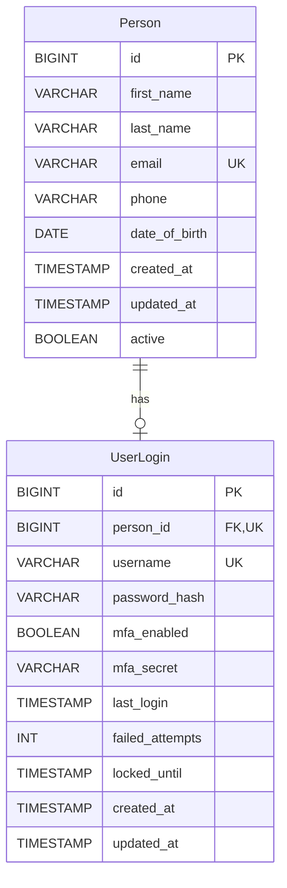

# Technical Specification: Person and UserLogin Entity Design

## 1. Overview

### 1.1 Purpose

This specification defines the data model and security requirements for user identity and authentication in the application. It establishes the separation between personal identity data (`Person`) and authentication credentials (`UserLogin`), following industry best practices and compliance with NIST SP 800-63-4 Digital Identity Guidelines.

### 1.2 Scope

This document covers:

- Entity relationship design for Person and UserLogin
- Database schema definitions
- Username and email handling policies
- Authentication security requirements
- Password storage and management
- Multi-factor authentication considerations

### 1.3 References

| Document | Description |
|----------|-------------|
| NIST SP 800-63-4 | Digital Identity Guidelines (July 2025) |
| NIST SP 800-63B-4 | Authentication and Authenticator Management |
| OWASP Authentication Cheat Sheet | Authentication best practices |
| OWASP ASVS 4.0 | Application Security Verification Standard |

---

## 2. Design Principles

### 2.1 Separation of Concerns

The design separates authentication credentials from personal identity data for the following reasons:

1. **Flexibility**: Allows users to change authentication methods without affecting profile data
2. **Security**: Limits exposure of sensitive credential data
3. **Extensibility**: Supports future integration with third-party identity providers (OAuth, SAML, OIDC)
4. **Data Integrity**: Personal data persists independently of authentication state
5. **Compliance**: Aligns with NIST recommendation to treat digital identity as distinct from authentication

### 2.2 Key Design Decisions

| Decision | Rationale |
|----------|-----------|
| Email stored in `Person` | Email is PII and profile data, not authentication data |
| Username in `UserLogin` | Username is an authentication identifier, may differ from email |
| 1:1 relationship | One person has one login; supports future 1:N for multiple auth methods |
| BCrypt hashing | Industry-standard algorithm with built-in salt; simple integration with Quarkus Security JPA |

---

## 3. Entity Relationship Model

### 3.1 Entity Diagram



### 3.2 Relationship Details

| Aspect | Specification |
|--------|---------------|
| Cardinality | One-to-One (1:1) |
| Direction | Bidirectional |
| Owner | `UserLogin` owns the relationship |
| Cascade | `Person` cascades ALL to `UserLogin` |
| Orphan Removal | Enabled |
| Optional | `UserLogin` is optional (Person can exist without login) |

---

## 4. Database Schema

### 4.1 Person Table

```sql
CREATE TABLE person (
    id BIGSERIAL PRIMARY KEY,
    first_name VARCHAR(100),              -- Optional, populated via profile
    last_name VARCHAR(100),               -- Optional, populated via profile
    email VARCHAR(255) NOT NULL,
    phone VARCHAR(20),
    date_of_birth DATE,
    created_at TIMESTAMP WITH TIME ZONE DEFAULT CURRENT_TIMESTAMP,
    updated_at TIMESTAMP WITH TIME ZONE DEFAULT CURRENT_TIMESTAMP,
    created_by VARCHAR(255),              -- Audit: who created this record
    updated_by VARCHAR(255),              -- Audit: who last updated this record
    active BOOLEAN DEFAULT TRUE,

    CONSTRAINT uq_person_email UNIQUE (email)
);

CREATE INDEX idx_person_email ON person(email);
CREATE INDEX idx_person_last_name ON person(last_name);
```

### 4.2 UserLogin Table

```sql
CREATE TABLE user_login (
    id BIGSERIAL PRIMARY KEY,
    person_id BIGINT NOT NULL,
    username VARCHAR(255) NOT NULL,
    password_hash VARCHAR(255) NOT NULL,
    role VARCHAR(50) NOT NULL DEFAULT 'user',  -- Single role (user, admin)
    mfa_enabled BOOLEAN DEFAULT FALSE,
    mfa_secret VARCHAR(255),
    last_login TIMESTAMP WITH TIME ZONE,
    failed_attempts INTEGER DEFAULT 0,
    locked_until TIMESTAMP WITH TIME ZONE,
    created_at TIMESTAMP WITH TIME ZONE DEFAULT CURRENT_TIMESTAMP,
    updated_at TIMESTAMP WITH TIME ZONE DEFAULT CURRENT_TIMESTAMP,
    created_by VARCHAR(255),              -- Audit: who created this record
    updated_by VARCHAR(255),              -- Audit: who last updated this record

    CONSTRAINT uq_user_login_username UNIQUE (username),
    CONSTRAINT uq_user_login_person UNIQUE (person_id),
    CONSTRAINT fk_user_login_person
        FOREIGN KEY (person_id)
        REFERENCES person(id)
        ON DELETE CASCADE
);

CREATE INDEX idx_user_login_username ON user_login(username);
CREATE INDEX idx_user_login_person_id ON user_login(person_id);
```

### 4.3 Login Audit Table (Recommended)

```sql
CREATE TABLE login_audit (
    id BIGSERIAL PRIMARY KEY,
    user_login_id BIGINT NOT NULL,
    event_type VARCHAR(50) NOT NULL,
    ip_address VARCHAR(45),          -- Supports IPv4 and IPv6
    user_agent VARCHAR(500),
    success BOOLEAN NOT NULL,
    failure_reason VARCHAR(255),
    created_at TIMESTAMP WITH TIME ZONE DEFAULT CURRENT_TIMESTAMP,
    
    CONSTRAINT fk_login_audit_user_login 
        FOREIGN KEY (user_login_id) 
        REFERENCES user_login(id) 
        ON DELETE CASCADE
);

CREATE INDEX idx_login_audit_user_login_id ON login_audit(user_login_id);
CREATE INDEX idx_login_audit_created_at ON login_audit(created_at);
CREATE INDEX idx_login_audit_event_type ON login_audit(event_type);
```

---

## 5. Username and Email Policy

### 5.1 Username Requirements

| Requirement | Specification |
|-------------|---------------|
| Format | Alphanumeric, dots, underscores, hyphens, or valid email |
| Length | 3-255 characters |
| Case | Case-insensitive (stored lowercase) |
| Uniqueness | Must be unique across all accounts |
| Email as Username | Permitted if email is verified |

### 5.2 Email as Username Considerations

#### Advantages

- Users are unlikely to forget their email address
- Already globally unique
- Simplifies registration process

#### Disadvantages

- Email addresses can change (job changes, provider switches)
- Exposes email to potential attackers if username is visible
- Recycled email addresses may cause account conflicts

#### Policy Decision

Users MAY use their email address as their username. The system SHALL:

1. Allow users to choose a different username if preferred
2. Validate email format when used as username
3. Require email verification before account activation
4. Support username changes without affecting email address
5. Never display full username in public contexts

### 5.3 Email Storage Location

Email SHALL be stored in the `Person` entity because:

- Email is Personally Identifiable Information (PII)
- Email serves communication purposes beyond authentication
- Person record should persist even if authentication method changes
- Supports future scenarios: multiple auth methods, federated identity

---

## 6. Security Requirements

### 6.1 Password Requirements (NIST SP 800-63B-4)

| Requirement | Specification |
|-------------|---------------|
| Minimum Length | 8 characters (12+ recommended) |
| Maximum Length | 64 characters minimum acceptance |
| Character Types | All ASCII and Unicode characters permitted |
| Composition Rules | None required (no mandatory special characters) |
| Blocklist Check | Required against known compromised passwords |
| Periodic Rotation | Not required unless compromise suspected |

#### Password Blocklist Sources

- Have I Been Pwned (HIBP) API
- NIST Bad Passwords List
- Application-specific weak passwords

### 6.2 Password Storage

| Component | Specification |
|-----------|---------------|
| Algorithm | BCrypt |
| Salt | Unique per-password, automatically generated (128-bit) |
| Cost Factor | 12 (2^12 = 4,096 iterations) |
| Hash Format | Modular Crypt Format (MCF), e.g., `$2a$12$...` |
| Quarkus Integration | `@Password(PasswordType.MCF)` for automatic verification |

```java
import io.quarkus.elytron.security.common.BcryptUtil;

// BCrypt configuration using Quarkus built-in utility
// Cost factor of 12 provides ~250-300ms hash time on modern hardware
// Increase to 13 or 14 as hardware improves
private static final int BCRYPT_COST = 12;

String hash = BcryptUtil.bcryptHash(password, BCRYPT_COST);
boolean valid = BcryptUtil.matches(password, hash);
```

### 6.3 Account Lockout Policy

| Parameter | Value | Configuration Key |
|-----------|-------|-------------------|
| Max Failed Attempts | 5 | `app.security.max-failed-attempts` |
| Lockout Duration | 15 minutes (progressive) | `app.security.lockout-minutes` |
| Progressive Multiplier | 2x per subsequent lockout | Built-in |
| Maximum Lockout | 24 hours | Built-in |
| Reset on Success | Failed attempts counter resets | Built-in |

**Note**: Configuration keys will be added to `application.properties` when lockout enforcement is integrated:
```properties
# Account lockout configuration (to be added)
app.security.max-failed-attempts=5
app.security.lockout-minutes=15
```

**Implementation Status**: ⏳ Schema and business logic methods exist in `UserLogin` entity (`isLocked()`, `recordFailedAttempt()`, `recordSuccessfulLogin()`). Enforcement during authentication is pending integration with `CaseInsensitiveIdentityProvider`.

### 6.4 Multi-Factor Authentication

Per NIST SP 800-63-4, MFA SHALL be supported with the following priority:

| Priority | Method | AAL Level |
|----------|--------|-----------|
| 1 | FIDO2/WebAuthn (Passkeys) | AAL3 |
| 2 | Hardware Security Keys | AAL3 |
| 3 | TOTP Authenticator Apps | AAL2 |
| 4 | Push Notifications | AAL2 |
| 5 | SMS (discouraged) | AAL1 |

**Note**: Email SHALL NOT be used as a second factor as it does not meet out-of-band requirements.

### 6.5 Session Management

| Parameter | Value | Status |
|-----------|-------|--------|
| Session ID Length | Minimum 128 bits entropy | ✅ Quarkus default |
| Session Timeout (Idle) | 30 minutes | ✅ `quarkus.http.auth.form.timeout=PT30M` |
| Session Timeout (Absolute) | 12 hours | ⏳ Future enhancement |
| Concurrent Sessions | Configurable per deployment | ✅ Quarkus default |
| Session Regeneration | Required after authentication | ✅ Quarkus default |

---

## 7. Quarkus Implementation

### 7.1 Person Entity

```java
package io.archton.scaffold.entity;

import io.quarkus.hibernate.orm.panache.PanacheEntity;
import jakarta.persistence.*;
import jakarta.validation.constraints.*;
import java.time.LocalDate;
import java.time.Instant;

@Entity
@Table(name = "person")
@EntityListeners(AuditListener.class)
public class Person extends PanacheEntity {

    // Optional - populated via profile settings, not during registration
    @Size(max = 100)
    @Column(name = "first_name", length = 100)
    public String firstName;

    // Optional - populated via profile settings, not during registration
    @Size(max = 100)
    @Column(name = "last_name", length = 100)
    public String lastName;

    @NotBlank
    @Email
    @Size(max = 255)
    @Column(nullable = false, unique = true)
    public String email;

    @Size(max = 20)
    @Column(length = 20)
    public String phone;

    @Past
    @Column(name = "date_of_birth")
    public LocalDate dateOfBirth;

    @Column(name = "created_at", nullable = false, updatable = false)
    public Instant createdAt;

    @Column(name = "updated_at", nullable = false)
    public Instant updatedAt;

    @Size(max = 255)
    @Column(name = "created_by", updatable = false)
    public String createdBy;

    @Size(max = 255)
    @Column(name = "updated_by")
    public String updatedBy;

    @Column(nullable = false)
    public boolean active = true;

    @OneToOne(mappedBy = "person", cascade = CascadeType.ALL,
              orphanRemoval = true, fetch = FetchType.LAZY)
    public UserLogin userLogin;

    @PrePersist
    protected void onCreate() {
        createdAt = Instant.now();
        updatedAt = Instant.now();
        if (email != null) {
            email = email.toLowerCase();
        }
    }

    @PreUpdate
    protected void onUpdate() {
        updatedAt = Instant.now();
        if (email != null) {
            email = email.toLowerCase();
        }
    }

    // Finder methods
    public static Person findByEmail(String email) {
        return find("email", email.toLowerCase()).firstResult();
    }

    /**
     * Get display name (firstName lastName, or email if names not set)
     */
    public String getDisplayName() {
        if (firstName != null && lastName != null) {
            return firstName + " " + lastName;
        } else if (firstName != null) {
            return firstName;
        } else if (lastName != null) {
            return lastName;
        }
        return email;
    }
}
```

### 7.2 UserLogin Entity

```java
package io.archton.scaffold.entity;

import io.quarkus.hibernate.orm.panache.PanacheEntity;
import io.quarkus.elytron.security.common.BcryptUtil;
import io.quarkus.security.jpa.Password;
import io.quarkus.security.jpa.PasswordType;
import io.quarkus.security.jpa.Roles;
import io.quarkus.security.jpa.UserDefinition;
import io.quarkus.security.jpa.Username;
import jakarta.persistence.*;
import jakarta.validation.constraints.*;
import java.time.Instant;

@Entity
@Table(name = "user_login")
@EntityListeners(AuditListener.class)
@UserDefinition
public class UserLogin extends PanacheEntity {

    @OneToOne(fetch = FetchType.LAZY, optional = false)
    @JoinColumn(name = "person_id", nullable = false, unique = true)
    public Person person;

    @Username
    @NotBlank
    @Size(min = 3, max = 255)
    @Column(nullable = false, unique = true)
    public String username;

    @Password(value = PasswordType.MCF)
    @NotBlank
    @Column(name = "password_hash", nullable = false)
    public String passwordHash;

    @Roles
    @Column(nullable = false)
    public String role = "user";

    // MFA fields (deferred implementation)
    @Column(name = "mfa_enabled", nullable = false)
    public boolean mfaEnabled = false;

    @Column(name = "mfa_secret")
    public String mfaSecret;

    // Login tracking
    @Column(name = "last_login")
    public Instant lastLogin;

    // Account lockout
    @Column(name = "failed_attempts", nullable = false)
    public int failedAttempts = 0;

    @Column(name = "locked_until")
    public Instant lockedUntil;

    // Audit fields
    @Column(name = "created_at", nullable = false, updatable = false)
    public Instant createdAt;

    @Column(name = "updated_at", nullable = false)
    public Instant updatedAt;

    @Size(max = 255)
    @Column(name = "created_by", updatable = false)
    public String createdBy;

    @Size(max = 255)
    @Column(name = "updated_by")
    public String updatedBy;

    @PrePersist
    protected void onCreate() {
        if (username != null) {
            username = username.toLowerCase();
        }
        createdAt = Instant.now();
        updatedAt = Instant.now();
    }

    @PreUpdate
    protected void onUpdate() {
        updatedAt = Instant.now();
    }

    // Business methods

    /**
     * Check if the account is currently locked.
     */
    public boolean isLocked() {
        return lockedUntil != null && Instant.now().isBefore(lockedUntil);
    }

    /**
     * Record a failed login attempt and apply progressive lockout if needed.
     *
     * @param maxAttempts    maximum allowed attempts before lockout
     * @param lockoutMinutes base lockout duration in minutes
     */
    public void recordFailedAttempt(int maxAttempts, int lockoutMinutes) {
        failedAttempts++;
        if (failedAttempts >= maxAttempts) {
            // Progressive lockout: 2^(lockout_count - 1) * base_minutes
            int lockoutCount = failedAttempts / maxAttempts;
            int multiplier = (int) Math.pow(2, lockoutCount - 1);
            long lockoutSeconds = (long) lockoutMinutes * 60 * multiplier;
            // Cap at 24 hours
            lockoutSeconds = Math.min(lockoutSeconds, 24 * 60 * 60);
            lockedUntil = Instant.now().plusSeconds(lockoutSeconds);
        }
    }

    /**
     * Record a successful login, resetting failed attempts and lockout.
     */
    public void recordSuccessfulLogin() {
        failedAttempts = 0;
        lockedUntil = null;
        lastLogin = Instant.now();
    }

    // Finder methods

    public static UserLogin findByUsername(String username) {
        return find("username", username.toLowerCase()).firstResult();
    }

    public static UserLogin findByPersonId(Long personId) {
        return find("person.id", personId).firstResult();
    }

    public static UserLogin findByEmail(String email) {
        return find("person.email", email.toLowerCase()).firstResult();
    }
}
```

### 7.3 Password Service

```java
package io.archton.scaffold.service;

import io.quarkus.elytron.security.common.BcryptUtil;
import jakarta.enterprise.context.ApplicationScoped;

/**
 * Service for password hashing and verification using BCrypt.
 * Uses Quarkus built-in BcryptUtil for seamless integration.
 */
@ApplicationScoped
public class PasswordService {

    // BCrypt cost factor (2^12 = 4096 iterations)
    // Increase this value as hardware improves
    private static final int BCRYPT_COST = 12;

    /**
     * Hash a plain text password using BCrypt.
     *
     * @param plainPassword the plain text password to hash
     * @return the BCrypt hashed password in MCF format
     */
    public String hashPassword(String plainPassword) {
        return BcryptUtil.bcryptHash(plainPassword, BCRYPT_COST);
    }

    /**
     * Verify a plain text password against a BCrypt hashed password.
     *
     * @param plainPassword  the plain text password to verify
     * @param hashedPassword the stored BCrypt hashed password
     * @return true if the password matches, false otherwise
     */
    public boolean verifyPassword(String plainPassword, String hashedPassword) {
        return BcryptUtil.matches(plainPassword, hashedPassword);
    }
}
```

### 7.4 Maven Dependencies

```xml
<!-- Quarkus Security JPA (includes BcryptUtil) -->
<dependency>
    <groupId>io.quarkus</groupId>
    <artifactId>quarkus-security-jpa</artifactId>
</dependency>

<!-- TOTP for MFA (when implemented) -->
<dependency>
    <groupId>dev.samstevens.totp</groupId>
    <artifactId>totp</artifactId>
    <version>1.7.1</version>
</dependency>

<!-- Bean Validation -->
<dependency>
    <groupId>io.quarkus</groupId>
    <artifactId>quarkus-hibernate-validator</artifactId>
</dependency>
```

**Note**: The `quarkus-security-jpa` extension provides `io.quarkus.elytron.security.common.BcryptUtil` for password hashing. No external BCrypt library (e.g., `org.mindrot:jbcrypt`) is required.

---

## 8. API Considerations

### 8.1 Authentication Endpoints

#### Current Implementation (Form-based)

| Endpoint | Method | Description |
|----------|--------|-------------|
| `/signup` | GET | Display registration form |
| `/signup` | POST | Create new account |
| `/login` | GET | Display login form |
| `/j_security_check` | POST | Authenticate user (Quarkus form auth) |
| `/logout` | GET | Terminate session and display logout page |

#### Future REST API (Planned)

| Endpoint | Method | Description |
|----------|--------|-------------|
| `/auth/register` | POST | Create new account |
| `/auth/login` | POST | Authenticate user |
| `/auth/logout` | POST | Terminate session |
| `/auth/refresh` | POST | Refresh access token |
| `/auth/password/reset` | POST | Request password reset |
| `/auth/password/change` | PUT | Change password (authenticated) |
| `/auth/mfa/enable` | POST | Enable MFA |
| `/auth/mfa/verify` | POST | Verify MFA code |

### 8.2 Response Security

- Never return password hashes in API responses
- Use consistent error messages to prevent user enumeration
- Return appropriate HTTP status codes

```java
// Bad: Reveals whether username exists
"Invalid username"
"Invalid password"

// Good: Generic message
"Invalid username or password"
```

---

## 9. Audit and Compliance

### 9.1 Required Audit Events

| Event | Data Captured | Status |
|-------|---------------|--------|
| Login Success | User ID, timestamp, IP, user agent | ⏳ Entity ready |
| Login Failure | Username attempted, timestamp, IP, reason | ⏳ Entity ready |
| Password Change | User ID, timestamp, IP | ⏳ Pending |
| MFA Enable/Disable | User ID, timestamp, IP | ⏳ Pending (MFA deferred) |
| Account Lock | User ID, timestamp, reason | ⏳ Entity ready |
| Account Unlock | User ID, timestamp, method | ⏳ Pending |

**Implementation Status**: ⏳ The `LoginAudit` entity exists with factory methods (`loginSuccess()`, `loginFailure()`, `accountLocked()`, `logout()`). Integration with the authentication flow is pending.

### 9.2 Data Retention

| Data Type | Retention Period |
|-----------|------------------|
| Audit Logs | 2 years minimum |
| Failed Login Attempts | 90 days |
| Session Data | Session lifetime + 30 days |

---


## Appendix B: Glossary

| Term | Definition |
|------|------------|
| AAL | Authenticator Assurance Level (NIST) |
| BCrypt | Password hashing algorithm with built-in salt (cost factor based) |
| BcryptUtil | Quarkus built-in utility (`io.quarkus.elytron.security.common.BcryptUtil`) for BCrypt hashing |
| MFA | Multi-Factor Authentication |
| MCF | Modular Crypt Format - standard format for password hashes (e.g., `$2a$12$...`) |
| TOTP | Time-based One-Time Password |
| FIDO2 | Fast Identity Online 2 standard |
| PII | Personally Identifiable Information |
| Salt | Random value unique to each password hash (auto-generated by BCrypt) |

---

## Appendix C: Browser Test Plan

The authentication test cases have been consolidated into the main test cases document.

**See:** [TEST-CASES.md](TEST-CASES.md) - Section TC-1: Authentication Tests (TC-1.01 to TC-1.20)

The test cases cover:
- Signup page UI and validation (TC-1.01 to TC-1.08)
- Login page UI and authentication (TC-1.09 to TC-1.14)
- Logout and session management (TC-1.15)
- Protected route access (TC-1.16 to TC-1.17)
- Security tests (TC-1.18 to TC-1.20)

---

## Appendix D: TC-16 Fix - Session Invalidation and Route Protection

### Issue Summary

**Test Executed**: December 25, 2025 via Chrome DevTools MCP

**TC-16 Result**: ✅ FIXED (December 27, 2025)

**Observed Behavior**:
1. User navigated to `/logout` and saw "You have been logged out" message
2. User navigated to `/persons` (protected route)
3. **Expected**: Redirect to `/login`
4. **Actual**: Full access to persons page with "Welcome, admin" displayed

### Root Cause Analysis

**Two distinct issues identified**:

#### Issue 1: Logout Does Not Invalidate Session

**Location**: `src/main/java/io/archton/htmx/resource/AuthResource.java:93-98`

```java
// CURRENT (BROKEN)
@GET
@Path("/logout")
@Produces(MediaType.TEXT_HTML)
public TemplateInstance logoutPage() {
    return Templates.logout();  // Just renders template, session remains valid!
}
```

The logout endpoint only renders a "logged out" template without actually invalidating the HTTP session or authentication context.

#### Issue 2: `/persons` Route Not Protected

**Location**: `src/main/resources/application.properties:23-26`

```properties
# CURRENT (INCOMPLETE)
quarkus.http.auth.permission.authenticated.paths=/api/*
quarkus.http.auth.permission.public.paths=/,/login,/signup,/css/*,/images/*,/j_security_check
```

The `/persons` path is not included in `authenticated.paths`, so it falls through without requiring authentication.

---

### Fix Implementation

All fixes have been applied. See current implementation in the codebase.

#### Step 1: Session Invalidation in Logout (✅ Implemented)

Modify `AuthResource.logoutPage()` to properly terminate the session:

```java
@Inject
io.vertx.ext.web.RoutingContext routingContext;

@GET
@Path("/logout")
@Produces(MediaType.TEXT_HTML)
public TemplateInstance logoutPage() {
    // Invalidate the session
    if (routingContext.session() != null) {
        routingContext.session().destroy();
    }
    // Clear the authentication credential cookie
    return Templates.logout();
}
```

**Alternative using SecurityIdentity**:

```java
@Inject
SecurityIdentity securityIdentity;

@Inject
HttpServerRequest request;

@GET
@Path("/logout")
@Produces(MediaType.TEXT_HTML)
public Uni<TemplateInstance> logoutPage() {
    return Uni.createFrom().item(() -> {
        // For form auth, clearing the cookie is essential
        // The cookie name is configured as "quarkus-credential"
        return Templates.logout();
    });
}
```

**Recommended Approach** - Use Quarkus built-in form auth logout:

Add to `application.properties`:
```properties
quarkus.http.auth.form.logout-path=/logout
```

Then redirect the logout page to use the form logout mechanism, or configure a custom logout handler.

#### Step 2: Route Protection for `/persons` (✅ Implemented)

Updated `application.properties` to protect the persons route:

```properties
# FIXED - Include /persons in protected paths
quarkus.http.auth.permission.authenticated.paths=/api/*,/persons
quarkus.http.auth.permission.authenticated.policy=authenticated

# Alternatively, use role-based protection matching PersonResource
quarkus.http.auth.permission.user-routes.paths=/persons
quarkus.http.auth.permission.user-routes.policy=authenticated
quarkus.http.auth.permission.user-routes.methods=GET,POST
```

#### Step 3: Cookie Invalidation for Complete Logout (✅ Implemented)

The authentication cookie is cleared in `AuthResource.logoutPage()` (see `src/main/java/io/archton/htmx/resource/AuthResource.java`):

```java
@GET
@Path("/logout")
@Produces(MediaType.TEXT_HTML)
public Response logoutPage() {
    // Clear the quarkus-credential cookie
    NewCookie clearCookie = new NewCookie.Builder("quarkus-credential")
        .value("")
        .path("/")
        .maxAge(0)
        .build();

    // Destroy session if exists
    if (routingContext.session() != null) {
        routingContext.session().destroy();
    }

    return Response.ok(Templates.logout())
        .cookie(clearCookie)
        .build();
}
```

---

### Verification Test Plan

After implementing fixes, re-run TC-16:

1. Login as `admin` / `Admin@01`
2. Verify access to `/persons`
3. Navigate to `/logout`
4. Attempt to access `/persons`
5. **Expected**: Redirect to `/login` page
6. Verify no session cookie remains (check DevTools > Application > Cookies)

### Additional Security Recommendations

1. **Add CSRF protection** for logout to prevent logout attacks
2. **Set Secure and HttpOnly flags** on session cookies in production
3. **Consider POST-based logout** instead of GET for better security
4. **Add session timeout** handling with appropriate redirect

---

### Implementation Status

| Task | Priority | Effort | Status |
|------|----------|--------|--------|
| Add `/persons` to protected paths | HIGH | Low | ✅ Done |
| Implement session invalidation in logout | HIGH | Medium | ✅ Done |
| Add cookie clearing on logout | MEDIUM | Low | ✅ Done |
| Add CSRF protection for logout | LOW | Medium | ⏳ Future |
